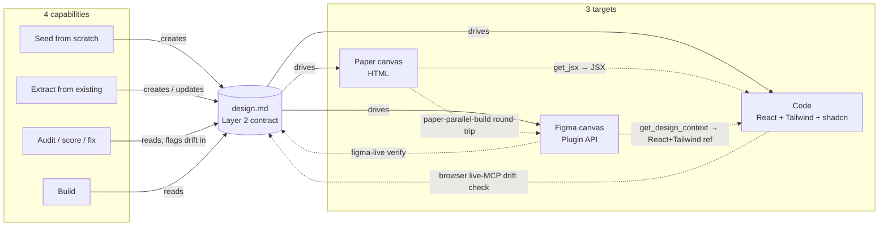
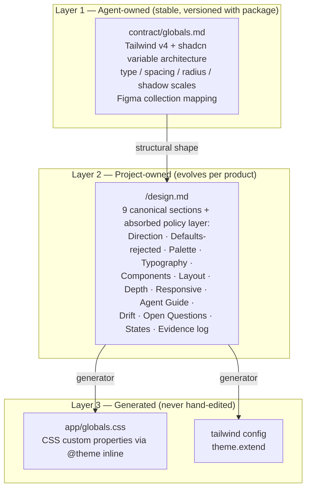
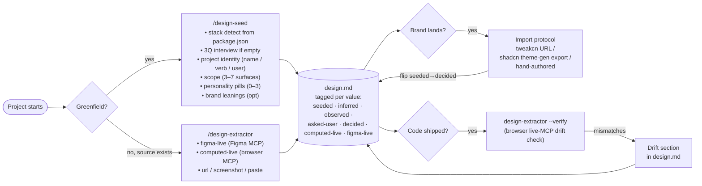
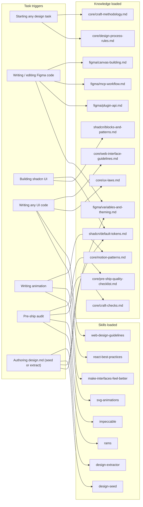
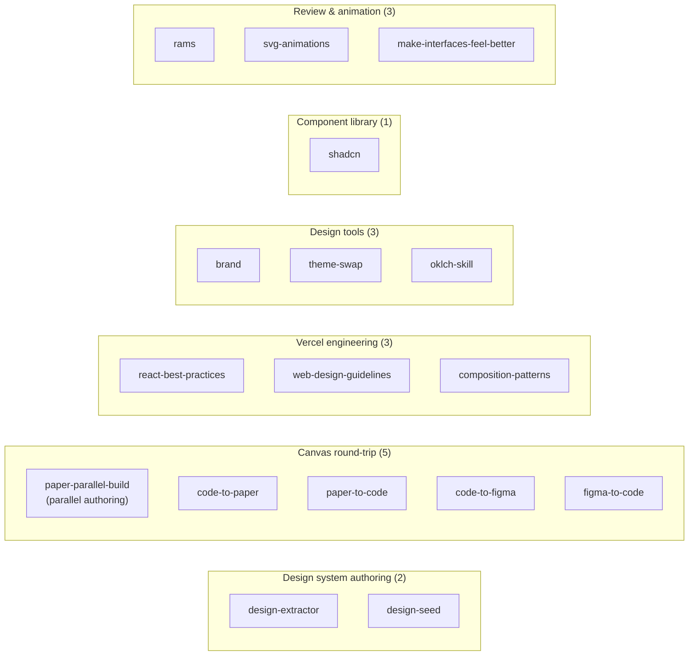
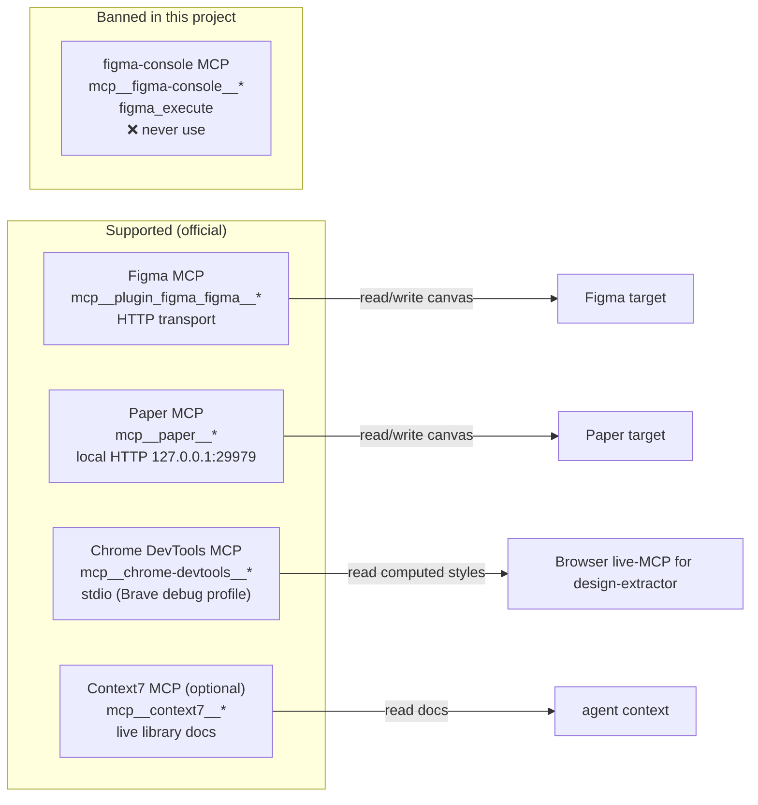
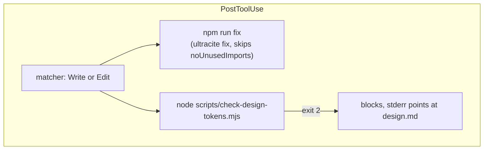
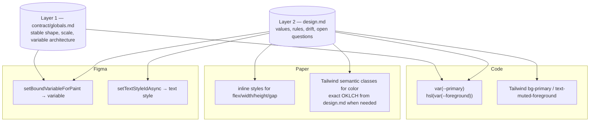

# Agent Data Model

> **Scope:** architecture of the `front-end-developer/` agent package itself. Not about any consumer project. This is the map of how the agent is built — what ships, what loads when, how skills route, how hooks fire, what connects to what. Update when the package structure changes.

> **Ship boundary:** everything under `front-end-developer/` is the agent. Sibling directories (consumer product folders like `Arca-Wallet/`, `Lakera/`) are **not** part of the agent — they are extraction/seed outputs that live alongside the agent in this repo for testing.

---

## Mission

The agent exists to **design, build, audit, extract, and maintain web UI** — primarily React sites with Tailwind + shadcn — across three targets, with free movement between them. One shared contract (`design.md`) mediates every flow.

### Four core capabilities

1. **Build** — produce working UI from a design.md (or a brief). Code, Paper HTML, or Figma as the output target.
2. **Audit** — score and fix shipped UI against craft standards. Delivered by the review skills (`rams`, `critique`, `audit`, `polish`, `normalize`) and the Impeccable command family. Findings flow back into design.md as Drift entries.
3. **Extract** — reverse-engineer a design.md from an existing product: a live site (browser live-MCP or URL), a Figma file (Figma live-MCP), or screenshots. Delivered by `design-extractor`.
4. **Seed** — bootstrap a design.md for a greenfield project with no existing source. Short stack interview + personality presets + shadcn defaults. Delivered by `design-seed`.

### Three targets, free movement



Solid arrows = primary authoring flows. Dotted arrows = round-trip / verification flows (MCP is the bridge).

### Stack focus

- **Primary depth:** Tailwind v4 + shadcn/ui (new-york) + Geist + Lucide + TypeScript. Every skill, knowledge file, and seed template is sharpest here.
- **Extensible but thin:** MUI, Chakra, Mantine, Ant, Panda, plain HTML/CSS — skeleton support via generic knowledge files. Dedicated seed templates and personality presets are **TBD** (gap #3).
- **Other stacks accepted, not optimized.** The agent won't refuse to work outside its sweet spot; it'll emit a design.md with more `[needs user confirmation]` tags and fewer opinionated rules.

### Contract-centered principle

Every flow routes through `design.md`. One source of truth, three target renderings, four capabilities acting on it. When a canvas changes, design.md mediates. When code ships, the extractor verifies code against design.md. When the team decides a brand value, it lands in design.md and regenerates downstream. No side channels, no per-target token maps, no separate theme manifests.

---

## 1. Package shape

```text
front-end-developer/
├── README.md               ← install instructions + MCP setup
├── LICENSE
├── TEAM-UI-WORKFLOW.md     ← human-team shortcut card (not loaded by agent)
├── data-model.md           ← this file
├── agent/
│   └── front-end-developer.md   ← the agent definition — rules, triggers, skill routing
├── contract/
│   ├── globals.md          ← Layer 1 — stable token architecture (ships with agent)
│   └── README.md
├── knowledge/              ← just-in-time reference libraries
│   ├── core/   (10 files)  ← methodology: craft, UX, motion, web guidelines, pre-ship
│   ├── figma/   (8 files)  ← Plugin API, MCP, canvas building, variables, recipes
│   ├── paper/   (3 files)  ← canvas HTML patterns, MCP workflow
│   └── shadcn/  (4 files)  ← tokens, blocks, Figma component map, theming
├── skills/                 ← 33 invocable skill bundles
│   └── <skill>/SKILL.md + references/
└── hooks/                  ← 5 reference .sh scripts (live hooks live in host .claude/settings.json)
```

Total: **~165 markdown files, ~33 k lines** at the current revision.

---

## 2. Contract layer architecture

The agent ships one layer and consumes two others. Ownership is strict: agent never writes to Layer 2 or 3 without explicit instruction; hosts never edit Layer 1.



**Ownership + cadence:**

| Layer | Owner | Cadence | Read by agent? | Written by agent? |
|---|---|---|---|---|
| 1 — `contract/globals.md` | agent package | versioned release | yes | no (ship-time only) |
| 2 — `design.md` | product team | per decision | yes | yes (via `design-seed` / `design-extractor` / import protocol) |
| 3 — `globals.css` / Tailwind config | build pipeline | regenerated on Layer 2 change | yes | no (team runs the generator) |

`system.md` (the old Layer 2 file under `.interface-design/`) has been **superseded** by `design.md`, which absorbs Direction / Defaults-rejected / Rule lines / Do-Don't / Drift / Open Questions inline alongside the evidence tables. The `interface-design` plugin convention (`.interface-design/system.md`) is deprecated but documented as legacy in `skills/design-extractor/references/contract-systemmd.md`.

---

## 3. design.md lifecycle

Two skills own design.md authoring. One protocol flips seeded → decided. The extractor's browser-live-MCP mode handles drift.



**Confidence tag ladder** (shared across both authoring skills and the extractor):

`figma-live` > `computed-live` > `asked-user` > `decided` > `observed` > `inferred` > `seeded`

Each token in design.md carries a tag. As the product matures, tags flip upward (seeded → decided after a brand choice; decided → computed-live after code verification). Drift is any computed-live value that disagrees with a decided value.

---

## 4. Knowledge loading flow

Knowledge files are **just-in-time**, not preloaded. Each load is triggered by a task type.



---

## 5. Skill categories (17 in-package bundles)



Total: 2 + 5 + 3 + 3 + 1 + 3 = **17 folders under `skills/`**, one per bundle. Each ships its own `SKILL.md` and may include a `references/` subfolder; `theme-swap` is `SKILL.md`-only.

**Relocated / removed since the last revision of this section:**

| Was | Now |
|---|---|
| `impeccable` + 21 command slots | moved out to `.claude/skills/impeccable/` — see below |
| `shape` (its own Planning category) | folded into impeccable as `reference/shape.md` |
| `emil-design-eng` | deleted |
| — | `oklch-skill` and `shadcn` added |

**External skills the agent can still reach.** `.claude/skills/` holds three bundles that are *not* part of this package but are invocable through the agent's `Skill` tool:

- **`impeccable`** — one skill with 32 `reference/*.md` sub-commands (`audit`, `critique`, `polish`, `distill`, `clarify`, `animate`, `typeset`, `layout`, `colorize`, `bolder`, `quieter`, `shape`, `live`, …) plus a large `scripts/` runtime. Invoked as `/impeccable`.
- **`figma-design`** — Figma design authoring.
- **`improve`** — the parked audit skill.

Counting them here would double-count: they live on their own release path and are versioned separately from this package.

---

## 6. MCP servers & rules

The agent supports three canvas/environment MCP integrations plus web fetching. All integrations are optional — the agent runs without any of them (it just loses the matching target).



**Hard rules (per project memory):**

1. Official Figma MCP only (`mcp__plugin_figma_figma__*`). **Never** `figma-console` MCP, `figma_execute`, or Desktop Bridge plugin.
2. Figma text nodes: always `setTextStyleIdAsync` — never hardcode `fontSize` / `lineHeight` / `fontName` directly.
3. Every fill / stroke / text color in Figma: bound via `setBoundVariableForPaint`. No orphan hex.
4. Paper `write_html(replace)` is destructive. Prefer `update_styles` for style-only changes.
5. Paper layout: avoid `margin`. Use parent `gap` / `padding`.

---

## 7. Hook enforcement

Hooks live inline in the **host's** `.claude/settings.json` (not shipped with the package). The package ships **no** `hooks/*.sh` scripts: the shell-side reference implementations earlier revisions of this section described are not present in this checkout.

Current live matchers in `.claude/settings.json`: one `PostToolUse` matcher, regex `Write|Edit`, running two commands.



There are **no PreToolUse matchers** at the project level. Two consequences:

1. **Enforcement is post-write, not pre-call.** Nothing gates an MCP or tool call. Every check fires after a `Write` or `Edit` has already landed, so an off-token value gets written and then rejected, never prevented.
2. **The design-token check is the only blocking hook.** `check-design-tokens.mjs` exits 2, which surfaces its stderr back as a correction the agent must act on. `ultracite fix` is advisory: it rewrites in place and cannot fail the turn.

`~/.claude/settings.json` adds user-scope `PreToolUse: Bash` and `SessionStart` hooks, but those are context-mode plumbing with no design enforcement.

**History:** the five PreToolUse matchers (three `mcp__paper__*`, two Figma) and the two Paper screenshot PostToolUse matchers this section used to document are all gone, as is the Paper MCP itself. If Figma write discipline is ever re-added as a hook, scope it to write operations only: the earlier `PostToolUse` hook on `use_figma` was removed because it paused every read-only call.

---

## 8. Build pipeline — three targets

```mermaid
sequenceDiagram
    participant U as User
    participant A as Agent (front-end-developer)
    participant DMD as design.md (Layer 2)
    participant G as globals.css (Layer 3)
    participant C as Code target
    participant P as Paper target
    participant F as Figma target

    U->>A: "Build a settings page"
    A->>DMD: Read Layer 2 contract (tokens, rules, do/don't)
    A->>G: Resolve runtime numeric values (if needed)
    A->>A: Plan component tree (target-agnostic)

    par Three targets — parallel or single
        A->>C: Write .tsx (state, handlers, Tailwind classes)
        A->>P: write_html (layout inline; tokens semantic)
        A->>F: use_figma (variables, bound paints, text styles)
    end

    A->>P: get_screenshot → verify parity
    A->>F: get_screenshot → verify parity
    A->>C: typecheck / lint (via host pipeline)

    U->>A: Feedback / adjustments
    A->>DMD: If new decision, update design.md
    A->>A: Apply to all three targets
```

Target selection is driven by the user's request — not every task hits all three. Code-only features skip Paper/Figma. Design-only explorations may skip Code.

---

## 9. Cross-target token flow



Rule: never bypass Layer 2. A raw hex in any target = drift to flag. A Figma paint without `setBoundVariableForPaint` = drift to flag. The extractor (browser-live-MCP mode) surfaces these automatically.

---

## 10. File inventory (current)

| Domain | Count | Notes |
|---|---|---|
| `contract/` | 2 | `globals.md` + `README.md` |
| `knowledge/core/` | 10 | methodology, motion, UX laws, pre-ship checklist |
| `knowledge/figma/` | 8 | Plugin API, MCP workflow, canvas, variables, recipes, docs-sources |
| `knowledge/shadcn/` | 4 | default tokens, blocks, Figma component map, theming |
| `skills/` | **17** bundles, 139 `.md` | see §5 |
| Root (pkg) | 1 `.md` | `data-model.md` (this file) |

**Total:** 164 markdown files plus 11 non-markdown across the package.

Two entries earlier revisions listed no longer exist:

- **`agent/`** — the agent definition is not in the package. It lives at `.claude/agents/front-end-developer.md`, outside this tree.
- **`knowledge/paper/`** — deleted. §6 still documents the Paper MCP as a supported target, but no Paper knowledge ships here and no Paper server is registered.

Regenerate counts with (run from `.claude/`):

```bash
find front-end-developer -type f -name '*.md' | wc -l
find front-end-developer/skills -maxdepth 1 -mindepth 1 -type d | wc -l
```

---

## 11. Gaps / architectural debt

Honest list of what doesn't yet fit or is missing. Update as items resolve or new ones surface.

### Open gaps

1. **No Layer 3 generator.** `design.md → globals.css / tailwind.config.ts` is documented as "generated" but no generator script ships in the package. Teams hand-maintain `globals.css` today. Build the generator (target: ~50-line script that reads §2/§3/§5/§6 and emits `@theme inline` + tailwind config).
2. **No drift-check mode in `design-extractor`.** Browser live-MCP mode can produce a design.md from scratch but can't yet diff against an existing design.md and emit a drift report. Add a `--verify` flag / trigger ("check code against the declared design.md").
3. **`design-seed` has one seed template.** Only `seed-tailwind-shadcn.md` exists. MUI / Chakra / Mantine / Ant / Panda / vanilla-extract / plain-HTML stacks need their own seed templates or will fall through to a skeleton. This directly constrains the Mission's "any HTML or React site" scope — today it's effectively "any Tailwind + shadcn site, skeleton support elsewhere."
4. **Residual `system.md` references across the package.** `agent/front-end-developer.md`, `CLAUDE.md`, several skill files still mention host `system.md` as Layer 2 even though `design.md` has absorbed that role. Not wrong (back-compat works) but the language drifts. Next pass: sweep and standardize on "design.md" as Layer 2.
5. **~~Canvas → code direction is implicit, not first-class.~~** Resolved — four new skills ship the explicit round-trip: `code-to-paper`, `paper-to-code`, `code-to-figma`, `figma-to-code`. See Recently resolved.
6. **Two ways to author design.md** (`design-extractor` + `design-seed`) share a template but the extractor's `template.md` and the seed's `seed-tailwind-shadcn.md` are separate files. Consider: can seed-shadcn become a preset loaded by the extractor in `seed` mode, rather than a parallel file?
7. **Personality presets only defined for shadcn.** `personality-presets.md` assumes the shadcn token namespace. Needs re-authoring if/when other stack seeds land.
8. **No CI lint for design.md shape.** Nothing today catches a design.md that drops the §Drift section, forgets to tag tokens, or invents confidence tiers. A validator script would make the contract enforceable.
9. **Paper MCP dependency on Paper Desktop running.** Not an architectural flaw but a real constraint — Paper target is unavailable if Paper Desktop isn't open. Document the fallback (code-only or Figma-only build) when Paper MCP is unreachable.
10. **`TEAM-UI-WORKFLOW.md` and `knowledge/core/skill-workflow.md` are two maps of the same territory.** They don't conflict but they drift over time. Pick one as canonical, make the other a pointer.
11. **No `contract/system-example.md`.** Teams adopting the agent have to read all of `globals.md` to understand what a filled-in Layer 2 looks like. A reference example design.md (like `references/example-galileo.md` in `design-extractor`) seeded at the contract level would accelerate onboarding.
12. **No `knowledge/mcp-gotchas.md`.** Session-lived failures — `loadAllPagesAsync` unsupported, `get_variable_defs` "nothing selected", `get_metadata` auto-saving when too large, Paper MCP disconnecting mid-session, hook prompts that say "ALLOW" but pause continuation — evaporate when a conversation ends. A dedicated gotchas file would carry them into future sessions.
13. **Audit → design.md drift backlog not formalized.** Mission §2 says audit findings "flow back into design.md as Drift entries." Today, review skills (`rams`, `critique`, etc.) produce a report — they don't automatically append to the design.md's Drift section. Either the skills need an explicit "write to design.md drift" step, or the extractor needs an "ingest audit report" mode.

### Recently resolved

- ~~Separate `system.md` deliverable~~ → absorbed into `design.md` (2026-04-20)
- ~~`.interface-design/` folder with stale Lotto system.md~~ → deleted (2026-04-21)
- ~~Confidence tags split between extractor and seed~~ → unified 7-tier ladder (2026-04-20)
- ~~Figma live-MCP mode missing from extractor~~ → added (2026-04-20)
- ~~Browser live-MCP mode missing from extractor~~ → added (2026-04-20)
- ~~`design-seed` skill didn't exist~~ → built (2026-04-20)
- ~~PostToolUse hook on use_figma paused every read-only call~~ → removed (2026-04-20)
- ~~Canvas → code direction implicit / no named skills for the round-trip~~ → **four new skills ship the explicit loop** (2026-04-21): `code-to-paper` + `paper-to-code` (Paper round-trip), `code-to-figma` + `figma-to-code` (Figma round-trip). Each pairs with the existing `design.md` contract. `paper-parallel-build` retained for net-new parallel authoring (distinct intent).

---

## 12. How to update this file

**When adding a knowledge file:**
1. Increment the count in §10 File Inventory.
2. If it maps to a task trigger, add a node in §4 Knowledge loading flow.

**When adding a skill:**
1. Add to the appropriate category in §5 Skill categories (or bump count).
2. If it ships an MCP dependency, update §6 MCP servers.
3. If it participates in design.md authoring, add to §3 design.md lifecycle.

**When adding a new target:**
1. Add to §1 Package shape (as a target, not a folder).
2. Add to §8 Build pipeline.
3. Add to §9 Cross-target token flow.
4. Wire hooks in the host `.claude/settings.json` and document in §7.

**When the contract layers shift** (new generator, new layer, new file type):
1. Update §2 Contract layer architecture.
2. Update §9 Cross-target token flow.
3. Move the relevant line from §11 Gaps → §11 Recently resolved.

**When resolving a gap:**
1. Strike the line in §11 Open gaps (or remove).
2. Add to §11 Recently resolved with a date.
3. If the resolution added architecture, reflect it in the diagrams above.
