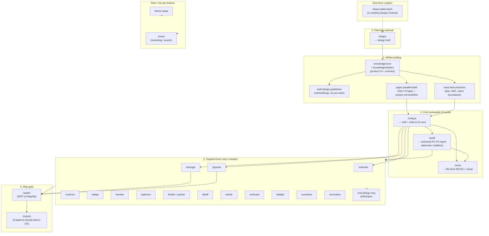

# Skill workflow — when to use what

This document maps all skills under `skills/` to a practical flow: **after you add a new section or feature, what to run.** It complements `README.md` and `data-model.md`.

### Principle — knowledge and methodology first

**`knowledge/core/`** is for *how to think and build* before and during implementation—intent, hierarchy, motion, accessibility depth, pre-ship checks. Pair it **early** with stack skills (**`web-design-guidelines`**, **`knowledge/shadcn/`** when working shadcn/Tailwind, **`react-best-practices`**, **`composition-patterns`**) so design and UX quality land **out of the gate**. Skills under **`skills/`** (especially Impeccable commands) are for **targeted correction, consistency, and final passes**—not the primary strategy if methodology was skipped.

---

## Default path (humans — you are not supposed to memorize every skill)

The long list exists so **agents** can load narrow instructions. **People** should use one short spine and ignore the rest until something specific comes up.

**Internalize only this (new app feature / section):**

| Step | What | If you use AI with this repo |
|------|------|-------------------------------|
| 1 | Ship working UI + tests/lint like any PR | Same |
| 2 | **Design context once** — if the team uses Impeccable, ensure `.impeccable.md` or teach flow exists | `/impeccable teach` once per project |
| 3 | **Review** — craft + “what’s still wrong?” | **`/critique`** on the area (triage; suggests follow-ups) |
| 4 | **A11y + obvious UI bugs on touched files** | **`/rams`** on those files (or your usual a11y checklist) |
| 5 | **Ship polish** — spacing, states, copy consistency | **`/polish`** before merge when bar is “ready to ship” |

**That’s it for day-to-day.** Everything else (`/arrange`, `/harden`, `/animate`, `emil-design-eng`, …) is **when critique/audit/polish or the ticket points you there**, not something the team memorizes.

**What to put in CONTRIBUTING / team wiki (one paragraph):**

> For UI work, follow the normal PR bar (lint, types, design tokens). **Apply `web-design-guidelines` while implementing**, not only at review. Optional AI passes: `/critique` → `/rams` on changed files → `/polish`. Full skill index is **this document** (`knowledge/core/skill-workflow.md`).

**Why this doesn’t leave you “stuck with a manual”:** the manual is for **lookup and agents**. Your **convention** is ~5 steps; the drawers below are for “something weird — which drawer?” not daily reading.

### Methodology — `web-design-guidelines` while building

**`skills/web-design-guidelines/SKILL.md`** (Vercel Web Interface Guidelines) is **not** review-only. Load it **when you start implementing UI**—together with **`knowledge/core/`**, **`knowledge/shadcn/`** when styling shadcn/Tailwind, **`system.md`** (when the host has it), and stack skills—and **apply the rules as you write** (semantics, focus, labels, motion, forms, touch targets, content). That is **default methodology**: better output from the first line of code. **`/rams`** and **`/polish`** then find gaps instead of replacing a whole pass of bolted-on fixes.

---

## The toolbox (drawers, not one flat list)

A long alphabetical list feels like a messy toolbox because **names don’t encode when to use them.** Use three ideas together:

1. **Phase** — *When* am I? (plan → build → review → targeted fix → ship)
2. **Cluster** — *Which drawer?* (Impeccable verbs vs stack skills vs reference libraries vs marketing)
3. **Impeccable** — One **meta** skill (`impeccable`) plus **20 slash commands** that share context (`/impeccable teach`, `.impeccable.md`). Those commands are **verbs**: each does one kind of adjustment. You don’t memorize all 20; you pick by **intent** (see groups below).

### Drawer A — Gateway & planning

| Skill | Reach for it when… |
|--------|----------------------|
| **impeccable** | You need **design context**, or you’re invoking **`/impeccable craft`**, or any Impeccable command says “invoke impeccable first.” |
| **shape** | **Before code:** discovery + **design brief** for a feature. |

### Drawer B — Impeccable slash commands (design verbs)

Same family: they assume Design Context exists (unless you’re only using mechanical skills like `/optimize` that don’t always need it—check each skill’s prep block).

| Group | Commands | Intent |
|--------|----------|--------|
| **Triage / measure** | `/critique`, `/audit` | *What’s wrong?* Critique = craft & story; audit = technical dimensions & severity. |
| **Ship** | `/polish`, `/extract` | *Finish.* Polish = last integrated pass; extract = promote patterns into the system. |
| **Fit the system** | `/normalize` | *Drifted from tokens/patterns—realign.* |
| **Simplify** | `/distill` | *Too much UI—strip to essence.* |
| **Words** | `/clarify` | *Copy/labels/errors unclear.* |
| **Layout & look** | `/arrange`, `/typeset`, `/colorize`, `/bolder`, `/quieter` | *Spatial hierarchy, type, color, intensity.* |
| **Motion & spark** | `/animate`, `/delight`, `/overdrive` | *Motion* → purposeful; *delight* → personality; *overdrive* → high-ambition / cinematic (use rarely). |
| **Real product** | `/adapt`, `/harden`, `/optimize`, `/onboard` | *Responsive*, *edge cases*, *performance*, *first-run & empty states.* |

**Mnemonic:** If you can say “I need to **verb** this screen” (clarify, arrange, harden…), start with the matching slash command. If you don’t know which verb, run **`/critique`** first—it’s the design-lead triage that points to other commands.

### Drawer C — Stack & code quality (not Impeccable-specific)

| Skill | Reach for it when… |
|--------|----------------------|
| **web-design-guidelines** | **Methodology:** load when you **start** UI work; apply Vercel Web Interface Guidelines **as you write** (a11y, UX, motion, forms). Use again for a dedicated review pass if needed. |
| **react-best-practices** | React/Next **performance** (RSC, lists, bundles, client boundaries). |
| **composition-patterns** | Component APIs, compound components, avoiding prop explosion. |
| **rams** | **File-scored** WCAG + visual pass on concrete paths (great after you have code). |

### Drawer D — Product UI defaults (what to load while building)

| Knowledge / skill | Reach for it when… |
|--------|----------------------|
| **`knowledge/shadcn/`** | **shadcn/Tailwind** tokens, blocks, theming, Figma mapping—pair with **`knowledge/core/`** for product-UI craft (dashboards, SaaS, tools). **Not** a substitute for marketing-landing stacks. |

### Drawer E — Workflow & infrastructure

| Skill | Reach for it when… |
|--------|----------------------|
| **paper-parallel-build** | **Paper + React** in parallel from the **active contract** (host `system.md` and/or `contract/globals.md` + `globals.css`). |
| **theme-swap** | Changing **global shadcn preset** / theme manifest / Figma sync checklist. |

### Drawer F — Reference libraries (tactics & taste, not “commands”)

Use these **during** build or polish when you want **specific techniques** or **philosophy**—they don’t replace `/critique` or `/polish`.

| Skill | Reach for it when… |
|--------|----------------------|
| **emil-design-eng** | Long-form **design-engineering** + motion implementation (taste, detail, easing, stagger). Pair with **`knowledge/core/motion-patterns.md`** for micro-tactics. |
| **svg-animations** | **Handcrafted SVG:** paths, viewBox, stroke-dash drawing, SMIL vs CSS, morphing constraints, gradients/masks, perf + `prefers-reduced-motion`. Use for **icons, diagrams, hero illustrations, logos** (especially marketing). Pair **`react-best-practices`** rule **`rendering-animate-svg-wrapper`** when applying CSS transforms to inlined SVG in React. |

### Drawer G — Marketing & brand (usually off the app-feature path)

**High-polish marketing / landings:** the default “in-app” spine (web guidelines + `system.md` / globals + core knowledge) is the wrong default—see **`agent/front-end-developer.md` → “Marketing pages & high-polish landings”** for the explicit load order (shape → web guidelines + impeccable + **svg-animations** for custom SVG → motion skills → critique / rams / polish + visual verification).

| Skill | Reach for it when… |
|--------|----------------------|
| **brand** | Brand voice, identity, guidelines—not the typical “new dashboard section” loop. |

### One sentence

**Impeccable = verb toolbox + shared context.** **Stack drawers = how code behaves.** **`knowledge/core/` + `knowledge/shadcn/` = what good product UI looks like in this repo** (with **`web-design-guidelines`** as methodology). **Emil + `motion-patterns.md` = motion and micro-detail reference**—not a parallel command system. (**`ui-ux-pro-max`** was removed from this package; use **`knowledge/core/`** + **`knowledge/shadcn/`** instead.)

---

## Audit — skills at a glance

| Skill | Role | Typical trigger |
|--------|------|------------------|
| **impeccable** | Hub: design context, anti-slop, `craft` / `teach` | Building UI, or any Impeccable command needs context |
| **shape** | Planning: design brief **before** code | New feature, unclear UX—brief before implementation |
| **critique** | Qualitative design review + scoring + follow-up commands | “Review this,” hierarchy, craft, personas |
| **audit** | Technical report (a11y, perf, theming, responsive, anti-patterns)—**document**, don’t fix | Measurable QA, P0–P3 style report |
| **polish** | **Final** pass: fix alignment, states, copy, consistency, ship bar | Feature complete; pre-merge / pre-launch |
| **normalize** | Realign to **design system** / tokens / drift | Inconsistent with system, token drift |
| **distill** | Remove complexity; simplify UI | Too busy, cluttered |
| **clarify** | UX copy, errors, labels, microcopy | Confusing text |
| **animate** | Purposeful motion / micro-interactions | Motion, transitions, hover |
| **typeset** | Typography hierarchy, fonts, readability | Type feels generic or wrong |
| **arrange** | Layout, spacing, rhythm, composition | Layout “off,” crowded, weak hierarchy |
| **colorize** | More strategic color / warmth | Too gray, dull |
| **bolder** | More impact / personality (watch AI-slop) | Too bland, safe |
| **quieter** | Tone down intensity | Too loud, garish |
| **delight** | Joy, personality, memorable touches | Fun, memorable moments (domain-appropriate) |
| **overdrive** | High-ambition (shaders, springs, cinematic) | “Wow,” technically ambitious |
| **optimize** | Perf: vitals, bundle, jank, images | Slow, laggy, heavy |
| **harden** | Edge cases, errors, i18n, overflow | Production robustness |
| **extract** | Pull patterns into **design system** / shared components | Duplication, “should be a component” |
| **adapt** | Responsive / breakpoints / devices | Mobile, cross-device |
| **onboard** | Onboarding, empty states, first-run | Activation, first-time users |
| **theme-swap** | Swap shadcn preset + regen theme docs / Figma checklist | New preset, rebrand theme |
| **paper-parallel-build** | Paper canvas + React from `system.md` | Dual design+code iteration |
| **web-design-guidelines** | Vercel Web Interface Guidelines — **apply while building** (methodology); optional extra pass for file review | Baseline a11y/UX rules from the first commit |
| **react-best-practices** | Vercel React/Next **performance** (64 rules) | RSC, bundles, lists, perf review |
| **composition-patterns** | Compound components, flexible APIs, React 19 | Prop explosion, library APIs |
| **rams** | **WCAG + visual** review on **files** | Targeted a11y + UI pass |
| **emil-design-eng** | Design-engineering philosophy (taste, detail) | Mindset + craft framing |
| **svg-animations** | SVG illustration + animation tactics (SMIL/CSS/path) | Inline SVG, diagrams, animated logos, landing visuals |
| **brand** | Voice, identity, compliance | Brand work |

---

## Flow: new section / feature

**Spine:** plan → build → review → fix → ship. **Branches** only when needed.

---

## Minimal path (shortest list)

1. **Context:** Design Context available (`/impeccable teach` once if not).
2. **Optional:** `/shape` when the problem isn’t well specified.
3. **While coding:** **`knowledge/core/`** + **`knowledge/shadcn/`** (product UI + active contract), plus **web-design-guidelines** + **react-best-practices** as defaults.
4. **When something real is on screen:** **`/critique`** first (maps to follow-up commands), then **`/rams`** on changed files (high-yield a11y/visual).
5. **Optional:** `/audit` for a separate **technical** scored report.
6. **Run only** the fix commands critique/audit surfaced (arrange, animate, harden, etc.).
7. **Optional:** **`emil-design-eng`** + **`knowledge/core/motion-patterns.md`** for leftover motion / micro-detail polish; **`svg-animations`** when the work is **SVG markup** (paths, diagrams, illustration motion), not general UI transitions.
8. **Last:** **`/polish`** before merge.
9. **After repeat patterns:** **`/extract`** if promoting components/tokens.

**Usually not on the default feature path:** **theme-swap** (global theme change only), **paper-parallel-build** (Paper workflow only), **brand** (marketing and asset work).

---

## How the review passes differ

| Pass | Role |
|------|------|
| **critique** | “Would we ship this as craft?” — composition, hierarchy, content truth; suggests commands. |
| **audit** | Measurable technical dimensions; documents findings (other commands fix). |
| **rams** | File-level WCAG + visual issues with concrete fixes. |
| **polish** | Integrated last pass once you’re not restructuring the feature. |

---

## Less is more — redundancy and what you can skip

You do **not** need every skill in `skills/` for a healthy workflow. Below: **overlap** (same problem, multiple bundles) and **optional** (only certain teams/workflows).

### Overlap — pick one primary, use others only when needed

| Topic | Skills involved | Practical “less” choice |
|--------|------------------|-------------------------|
| **Motion craft** | `animate`, `delight`, `overdrive`, `emil-design-eng`, `svg-animations`, `motion-patterns.md` | **UI motion:** **`animate` + `emil-design-eng` + `knowledge/core/motion-patterns.md`**. **SVG-heavy** (paths, SMIL, stroke drawing, morphing): add **`svg-animations`**. Use **`delight`** / **`overdrive`** rarely (personality / spectacle). |
| **A11y / UX rules** | `web-design-guidelines`, `rams`, `/audit`, `/polish` (states), `pre-ship-quality-checklist.md` | **`web-design-guidelines`** = **methodology during implementation** (rules as you write). **`/rams`** on touched files before ship. **`/audit`** if you want a scored multi-dimension *report* — skip if `critique` + `rams` + `polish` are enough. Checklist doc overlaps **`/polish`** — use one ship ritual. |
| **Contract vs craft** | `knowledge/core/`, `impeccable`, `system.md` | **`system.md`** is the contract when it exists. **Core knowledge + Impeccable** carry craft and product-UI decisions; extend `system.md` when you discover new patterns. |
| **Intensity / simplification** | `bolder`, `quieter`, `distill`, `colorize` | Same *phase* of work (rebalance the UI). You rarely need all four names memorized — **`/critique`** usually tells you which direction. |

### Optional by team — often omit entire drawers

| Skill(s) | Skip when… |
|----------|-------------|
| **`brand`** | You only ship **in-app** UI and handle brand elsewhere. |
| **`paper-parallel-build`** | You don’t use **Paper** as a canvas. |
| **`theme-swap`** | You are not **changing the global shadcn preset**. |
| **`shape`** | Ticket + `system.md` already fully specify UX — brief step unnecessary. |

### Impeccable commands — not all 20 every feature

Treat them as **specialists**. For many PRs the path is: **`/critique` → targeted one or two verbs → `/polish`**. Commands like **`/onboard`**, **`/overdrive`**, **`/extract`** are **event-driven** (new activation flow, hero moment, design-system promotion) — not per feature.

### If you maintain a slimmer fork of `skills/`

Reasonable **delete candidates** only if you accept narrower agent coverage: e.g. **`emil-design-eng`** (if `motion-patterns.md` alone is enough for your team — worse for deep motion reference). **Do not** delete arbitrary Impeccable verbs without updating **`audit` / `critique`** cross-references.

---

## Related knowledge (not skills)

- **`contract/globals.md`** (bundled with the agent) — Layer 1 stable token/layout boilerplate; pair with the host **`globals.css`**.
- **Host `system.md`** — Theme + Project contract when the host maintains it (optional until extract/write).
