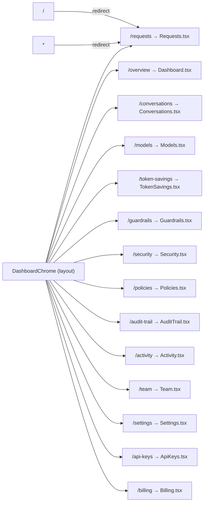
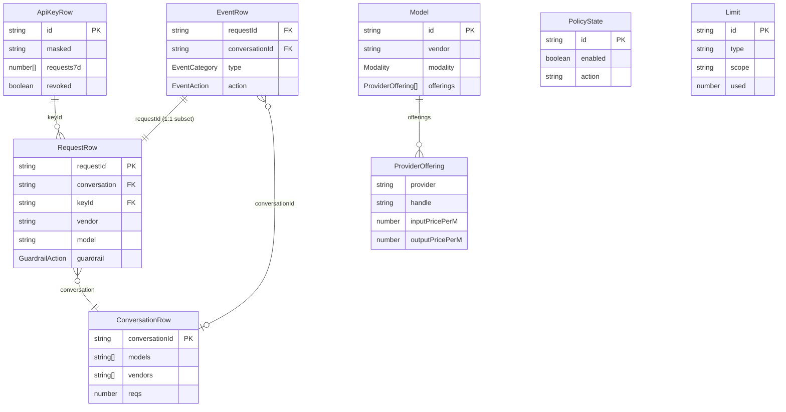
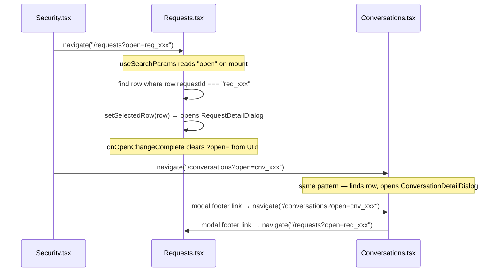

# Constellation Gate AI — Dashboard Architecture

> **Scope:** This file documents the architecture of the **Gate AI dashboard** (`gate-ai-build` repo) — its pages, routing, TypeScript types, mock data model, entity relationships, cross-page deep-links, design system, and component library. Update it when the page surface, data model, or design system changes.

---

## 1. Stack

| Layer | Tech | Version |
|---|---|---|
| Framework | React + Vite | 19.2.5 / 8.0.10 |
| Routing | react-router-dom | 7.3.0 |
| Styling | Tailwind v4 (`@tailwindcss/vite`) | 4.2.4 |
| Headless UI | `@base-ui/react` | 1.4.1 |
| Charts | recharts | 3.8.0 |
| Icons | lucide-react | 1.14.0 |
| Font | Geist (variable) | 5.2.8 |
| Toasts | sonner | 2.0.7 |
| Calendar | react-day-picker | v10 |
| Animation | tw-animate-css | 1.4.0 |
| Language | TypeScript | ~6.0.2 |

**No backend.** All data is mock — embedded seed arrays and deterministic generators in each page file. No dark mode (intentionally absent).

---

## 2. Routing & Navigation

### Route map



- Default route: `/` and `*` both redirect to `/requests`.
- All routes share `DashboardChrome` as their layout wrapper.
- Sidebar expand/collapse state lives in `App.tsx` with `localStorage` persistence; passed to pages via `useOutletContext<{ sidebarExpanded: boolean; toggleSidebar: () => void }>()`.

### Sidebar navigation

Five sections defined in `src/layouts/nav-sections.ts` → `SIDEBAR_SECTIONS`:

| Section | Nav items (id → path) |
|---|---|
| _(unnamed)_ | overview → `/overview`, requests → `/requests`, conversations → `/conversations` |
| Gateway | models → `/models`, token-savings → `/token-savings`, guardrails → `/guardrails` |
| Security | security-events → `/security`, policies → `/policies` |
| Audit | audit-trail → `/audit-trail` _(stub page; full surface in flight)_ |
| Workspace Admin | activity → `/activity`, team → `/team`, billing → `/billing`, api-keys → `/api-keys`, settings → `/settings` |

Each page passes its own `activeNavId` string to `<DashboardChrome>` to mark the correct sidebar item active.

---

## 3. TypeScript Type System

All types live inline in their respective page files. There is no shared `types/` directory — cross-page reuse is via import from the page that defined the type.

### 3.1 Shared primitive types

```typescript
// Time-range filtering (all pages that have a range selector)
type PresetRange = 'all' | '24h' | '7d' | '30d'
type RangeKey    = PresetRange | 'custom'
type CustomRange = { from: Date; to: Date }
type EventsRange = PresetRange | 'custom'

// Vendor & provider dimensions
type Vendor = 'anthropic' | 'xai' | 'google' | 'openai' | 'meta' | 'mistral' | 'deepseek' | 'cohere'
type MarketplaceProvider = 'bedrock' | 'azure' | 'vertex' | 'together' | 'fireworks' | 'groq'
type ProviderId = Vendor | MarketplaceProvider

// Response statuses
type ResponseStatus  = 'success' | 'error'
type GuardrailAction = 'allow' | 'flagged' | 'redacted' | 'block'
type GuardrailReason = 'injection' | 'pii' | 'credential'
type EventAction     = 'blocked' | 'flagged' | 'redacted'
type EventCategory   = 'injection' | 'pii' | 'phi' | 'credential'
```

### 3.2 API Keys

```typescript
// Defined in: src/pages/ApiKeys.tsx
interface ApiKeyRow {
  id:          string          // "prod-web", "prod-agent", "test-key"
  name:        string
  masked:      string          // "sk-gw-438" — display-only
  requests7d:  number[]        // 7-element sparkline
  lastUsed:    Date
  revoked?:    boolean
}
```

Canonical seed: 3 keys (prod-web, prod-agent active; test-key revoked). Revoked keys are filtered out of every scope dropdown, key picker, and limit target across the app — "all my keys" = active keys only.

### 3.3 Requests

```typescript
// Defined in: src/pages/Requests.tsx
interface RequestRow {
  day:             string
  time:            string
  relative:        string
  status:          ResponseStatus
  guardrail:       GuardrailAction
  code:            number
  vendor:          Vendor
  model:           ModelId
  conversation:    string         // conversationId cross-link
  keyId:           string
  inTokens:        number
  outTokens:       number
  latency:         number
  slow?:           boolean
  cost:            number
  guardrailReason?: GuardrailReason
  requestId?:      string         // links Security events → this request
}
```

### 3.4 Security Events

```typescript
// Defined in: src/pages/Security.tsx
interface EventRow extends RequestRow {
  type:           EventCategory
  key:            string
  action:         EventAction
  requestId:      string          // cross-link → /requests?open=req_xxx
  conversationId?: string         // cross-link → /conversations?open=cnv_xxx
  keyTier:        string
}
```

### 3.5 Conversations

```typescript
// Defined in: src/pages/Conversations.tsx
type ConversationStatus = 'active' | 'completed' | 'failed'

interface ConversationRow {
  title:          string
  conversationId: string          // cross-link from Security / Requests
  initiator:      string
  turns:          number
  reqs:           number          // count of RequestRows referencing this
  vendors:        Vendor[]
  models:         ModelId[]
  inTokens:       number
  outTokens:      number
  cost:           number
  status:         ConversationStatus
  updated:        Date
  duration:       string
}
```

### 3.6 Models & Providers

```typescript
// Defined in: src/pages/Models.tsx
type ModelId   = 'claude-opus-4-7' | 'claude-sonnet-4-5' | 'claude-haiku-4-5'
               | 'gpt-5' | 'gpt-4o' | 'gpt-4o-mini'
               | 'gemini-3-pro' | 'gemini-3-flash' | 'gemini-3-flash-lite'
               | 'llama-3-3-70b'

type Modality  = 'text' | 'embeddings' | 'audio' | 'rerank'
type Capability = 'vision' | 'tools' | 'json' | 'streaming' | 'cache' | 'webSearch'

interface ProviderOffering {
  provider:        ProviderId
  handle:          string
  contextK:        number
  maxOutputK:      number
  latencyP50Ms?:   number
  throughputTps?:  number
  inputPricePerM:  number
  outputPricePerM: number
  cacheReadPerM?:  number
  cacheWritePerM?: number
}

interface Model {
  id:             string
  vendor:         Vendor
  name:           string
  description:    string
  modality:       Modality
  capabilities:   Capability[]
  defaultHandle:  string
  offerings:      ProviderOffering[]
}
```

25 models across 8 vendors seeded in `MODELS`. Each model lists all provider offerings (e.g., Claude Opus 4.7 available via anthropic, bedrock, vertex).

### 3.7 Policies & Guardrails

```typescript
// Defined in: src/pages/Policies.tsx
interface ActionOption {
  value:       string
  name:        string
  flag?:       'DEFAULT'
  description: string
}

interface PolicyConfig {
  id:            string
  name:          string
  scanTag:       string
  icon:          string
  description:   string
  sensitivity?:  string
  scanDirection?: string
  action: { helper: string; options: ActionOption[] }
}

interface PolicyState {
  id:             string
  enabled:        boolean
  sensitivity?:   string
  scanDirection?: string
  action:         string
}

// Defined in: src/pages/Guardrails.tsx
interface Limit {
  id:        string
  name:      string
  type:      string           // 'spend' | 'tokens' | 'requests'
  threshold: number
  period:    string           // '1h' | '1d' | '1w' | '1mo'
  scope:     string           // org-wide, project-level, key-level
  used:      number
}
```

### 3.8 UI component types

```typescript
// Defined in: src/components/ui/code-card.tsx
type CodeTone   = 'default' | 'muted' | 'keyword' | 'string' | 'variable' | 'property' | 'punctuation'
type CodeToken  = { text: string; tone?: CodeTone }
type CodeLine   = CodeToken[]

// Defined in: src/components/ui/message-block.tsx
type MessageRole = 'system' | 'user' | 'tool' | 'assistant'

// Defined in: src/components/ui/chart.tsx (recharts wrapper)
type ChartConfig = Record<string, { label?: ReactNode; icon?: ComponentType } & ({ color: string } | { ... })>
```

### 3.9 Vendor metadata

```typescript
// Defined in: src/components/icons/vendor-meta.tsx
interface VendorMeta {
  color: string      // brand hex for standalone SVG rendering
  icon:  ComponentType
  label: string
}
interface MarketplaceMeta {
  color: string
  icon:  ComponentType
  label: string
}

// VENDOR_META: Record<Vendor, VendorMeta>
// Vendors: anthropic, xai, google, openai, meta, mistral, deepseek, cohere
// PROVIDER_ORDER: ProviderId[] — canonical sort for provider tables
```

---

## 4. Entity Relationships



**Key coupling rules:**
- `EventRow` is a subset of `RequestRow` — security events are exactly 0.25× request volume across all ranges (24h: 12 = 0.25×48; 7d: 117 ≈ 0.25×468; 30d: 562 ≈ 0.25×2,248; all: 1215 ≈ 0.25×4,860).
- `ConversationRow.reqs` counts how many `RequestRow` entries reference that `conversationId`.
- `ApiKeyRow.requests7d` sparkline must stay consistent with `API_KEY_ROWS` in Activity.

---

## 5. Mock Data Architecture

The app has no backend. All data is seeded in-file. The three rules:

1. **Single source of truth.** KPI tiles, chart bars, descriptions, and breakdowns all derive from one constant or generator function. Never hardcode the same number in two places.
2. **Deterministic LCG seeding.** Bucket/sparkline distributions use a linear congruential generator so they look realistic but reproduce exactly.
3. **Cross-page consistency.** Event totals = 0.25× request totals. Range scaling uses a shared `RANGE_SCALE` multiplier. Model/vendor distribution matches across pages.

### 5.1 Canonical totals

| Page | Constant | Value |
|---|---|---|
| Requests | `HERO_ALL_TOTAL` | 4,860 |
| Requests | `HERO_24H_TOTAL` | 48 |
| Requests | `HERO_7D_TOTAL` | 468 |
| Requests | `HERO_30D_TOTAL` | 2,248 |
| Security | `EVENTS_RANGE_TOTAL['all']` | 1,215 |
| Security | `EVENTS_RANGE_TOTAL['7d']` | 117 |
| Activity | `TOTAL_7D_BASE_DOLLARS` | $238 |
| Activity | `TOTAL_7D_BASE_REQUESTS` | 63,793 |
| Activity | `TOTAL_7D_BASE_TOKENS` | 73,450,000 |

### 5.2 Range scaling

```typescript
// Activity.tsx
const RANGE_SCALE: Record<PresetRange, number> = {
  '24h': 0.16,
  '7d':  1,
  '30d': 4.2,
  'all': 8.5,
}
```

KPI values for other ranges are derived by multiplying the 7d base by the scale factor. Charts apply the same factor to per-bucket arrays.

### 5.3 Key generators

```typescript
// LCG-based distribution — used in Requests, Security, Activity
function distributeSeries(total: number, count: number, seed: number): number[] {
  let s = (seed * 2654435769) >>> 0 || 1;
  const rand = () => { s = (s * 1664525 + 1013904223) >>> 0; return s / 0xffffffff; };
  // weights: 75% normal, 15% spike, 10% dip. Trend 0.7→1.3.
  // Last bucket absorbs remainder for exact sum.
}

// Security — projects totals onto 31:14:2 ratio (blocked:flagged:redacted)
// Uses largest-remainder algorithm for exact integer sum.
function splitEventMix(total: number): { blocked, flagged, redacted }

// Sparklines (7-point) for API key request history
function buildSpark(total: number, seed: number): number[]
```

### 5.4 Seed arrays

| Array | Page | Shape | Count |
|---|---|---|---|
| `REQUEST_ROWS` | Requests | `RequestRow[]` | 17 (cumulative: 24h ⊂ 7d ⊂ 30d ⊂ all) |
| `EVENT_ROWS` | Security | `EventRow[]` | 17 |
| `CONVERSATION_ROWS` | Conversations | `ConversationRow[]` | 8 |
| `CONVERSATION_MESSAGES` | Conversations | message thread | 8 |
| `SAMPLE_TRACE` | Conversations | trace events | 7 |
| `MODELS` | Models | `Model[]` | 25 |
| `MODEL_ROWS` | Activity | usage rows | 7 |
| `API_KEY_ROWS` | Activity | key usage rows | 10 |
| `MEMBER_ROWS` | Team | `MemberRow[]` | 4 |
| `INVITATION_ROWS` | Team | `InvitationRow[]` | 2 |
| `POLICIES` | Policies | `PolicyConfig[]` | 3 |
| `VOLUME_DATA` | Dashboard | 7-day bar data | 7 bars × 6 series |
| `RECENT_REQUESTS` | Dashboard | summary rows | 8 |

---

## 6. Page Inventory

### Overview page (`/overview` → `Dashboard.tsx`)

**Purpose:** Cost, security, and audit anchor rollup across the workspace. Lead surface for both H1 personas (Olivia + Devon); audit feed serves H2 wedge (Grace).

**Sections (top → bottom):**
1. `PageHeader` — title + subtitle sourced from Notion H1 Narrative & Positioning ("Cost controls, inline security, and a tamper-evident audit trail. Anchored to Constellation's Digital Evidence layer.")
2. `KpiRail` (4 tiles, all click-through):
   - Daily spend → `/activity?range=24h`
   - Monthly spend → `/activity?range=30d`
   - Threats detected → `/security`
   - Events anchored → `/audit-trail`
3. `QuickActionsRow` — 4 evenly-styled tiles: Set a spend limit (`/guardrails?create=1`) · Review Security Events · Rotate API Key · Read Integration Guide
4. `RecentConversationsCard` — top 8 conversations preview (columns mirror Conversations page)
5. `RecentSecurityEventsCard` — top 8 blocked/flagged events (preview of Security page log)
6. `RecentAnchoredEventsCard` — top 8 audit-trail entries (columns mirror AuditTrail page; row click opens `AuditRecordDialog`)

**State:** None beyond sidebar context.

**Data:**
- `THREATS_DETECTED_COUNT` = `EVENT_ROWS.length` (from `Security.tsx`)
- `ANCHORED_EVENTS_COUNT` = `AUDIT_EVENT_ROWS.length` (from `AuditTrail.tsx`)
- `MONTHLY_SPEND_DOLLARS` = `TOTAL_7D_BASE_DOLLARS * 4.2` (reconciles to Activity 30d window)
- `DAILY_SPEND_DOLLARS` = `TOTAL_7D_BASE_DOLLARS / 7`
- Sparklines: every spark derives from its tile's canonical total via `distributeSeries(total, count, seed)` (exported from `Activity.tsx`). Bucket sums equal the KPI value by construction (single source of truth: total → spark → tile).
- Preview tables sort by `at`/`updated`/`time` desc and `.slice(0, 8)` for the canonical 8-row glance cap.

**Cross-page imports:**
- `Activity.tsx` → `TOTAL_7D_BASE_DOLLARS`, `distributeSeries`
- `Security.tsx` → `EventRow`, `EVENT_ROWS`, `ACTION_BADGE`, `TYPE_META`, `formatEventTime`, `ThreatEventDetailDialog`
- `AuditTrail.tsx` → `EVENT_ROWS as AUDIT_EVENT_ROWS`, `EventRow as AuditEventRow`, `KIND_BADGE_VARIANT`, `fmtTime`, `truncateHex`
- `Conversations.tsx` → `CONVERSATION_ROWS`, `KEY_SUFFIX`, `ConversationRow`
- `AuditRecordDialog.tsx` → `AuditRecordDialog`

---

### Requests page (`/requests` → `Requests.tsx`)

**Purpose:** Full request log with drill-in detail modal.

**State:**
```typescript
range:       PresetRange         // default 'all'
customRange: CustomRange | null
keyId, model, status, code: string  // filters
page, rowsPerPage: number
selectedRow: RequestRow | null     // drives detail modal
searchParams: URLSearchParams       // for ?open= deep-link
```

**Deep-link:** `?open=req_xxx` → auto-opens detail modal for matching row; URL cleaned via `onOpenChangeComplete`.

**Modal sections:** Messages panel → Trace details → Security checks (3: injection/PII/credential)

**Outbound links from modal:** `/conversations?open=${conversationId}`

**Hero views (`HERO_VIEWS`):** Per `RangeKey` spec with total, success/error/slow counts, sparkline data, tick labels.

---

### Conversations page (`/conversations` → `Conversations.tsx`)

**Purpose:** Conversation-grouped view — each row is a multi-request session.

**State:** Same `range/customRange/keyId/model/page/rowsPerPage` pattern + `selectedRow: ConversationRow | null`.

**Deep-link:** `?open=cnv_xxx` → auto-opens conversation detail modal.

**Modal sections:** ConversationKpiRail (6 tiles) → ConversationMessagesPanel → RequestTracePanel

**Cross-panel linking:** `activeRequestId` state shared between Messages and Trace panels for synchronized highlights.

**Outbound links from modal:** `/requests?open=${requestId}` (from trace entries)

---

### Security page (`/security` → `Security.tsx`)

**Purpose:** Real-time threat detection log — injection, PII, credential events.

**State:** Same `range/customRange/query/type/keyFilter/action/page/rowsPerPage` + `selectedRow: EventRow | null`.

**No incoming deep-link** (Security does not accept `?open=`).

**Outbound links from modal:**
- `/conversations?open=${conversationId}`
- `/requests?open=${requestId}`

**Data:** `EVENT_MIX = { blocked: 31, flagged: 14, redacted: 2 }` ratio applied via `splitEventMix()` to `EVENTS_RANGE_TOTAL`.

---

### Models page (`/models` → `Models.tsx`)

**Purpose:** Routable model catalog with multi-provider offerings and code samples.

**State:**
```typescript
selectedModel: Model | null        // list ↔ detail toggle (no URL change)
modality:      'all' | Modality
search, vendor, provider: string
sort: 'newest' | 'popular' | 'cheapest' | 'largest-context'
page, rowsPerPage: number
```

**Detail view sections:** Hero → ModelKpiRail (4 tiles) → ProvidersTable → Quick start PlatformPanel (6 platforms) → CodeCard (TypeScript / Python / cURL tabs)

---

### Token Savings page (`/token-savings` → `TokenSavings.tsx`)

**Purpose:** Caching and compression metrics and settings.

**State:** `cachingEnabled: boolean`, `ttl: '5m'|'30m'|'1h'|'6h'|'24h'`, `compressionEnabled: boolean`

**Data:** KPI tiles currently hardcoded at "0%" / "$0 saved" (placeholder).

---

### Guardrails page (`/guardrails` → `Guardrails.tsx`)

**Purpose:** Spend / token / request rate caps.

**State:** `createOpen: boolean`, `limits: Limit[]`

**Dialog fields:** Name, Type (`LIMIT_TYPES`), Threshold, Period (`LIMIT_PERIODS`), Scope (org-wide, key-level)

---

### Policies page (`/policies` → `Policies.tsx`)

**Purpose:** Configure 3 inline security scans: prompt injection, PII/PHI, credential & secrets.

**State:** `policies: PolicyState[]`

**POLICIES seed:** 3 `PolicyConfig` objects with nested sensitivity / scan-direction / action options. Each policy card expands when enabled.

---

### Audit Trail page (`/audit-trail` → `AuditTrail.tsx`)

**Purpose:** Tamper-evident, cryptographically verifiable log of every routed request — anchored to Constellation's Digital Evidence layer. Hero differentiator of the H1 narrative.

**Status:** Built (2026-05-16). Title + subtitle + range selector + 4-tile KPI rail + paginated event log with toolbar. Per-row drill-in (cryptographic-proof side panel) lands in a follow-up.

**Page-level state:**
```typescript
const [range, setRange] = useState<Range>('all');           // 'all' | '24h' | '7d' | '30d' | 'custom'
const [customRange, setCustomRange] = useState<CustomRange | null>(null);
const rangeRows = useMemo(
  () => EVENT_ROWS.filter((r) => isWithinRange(r.at, range, customRange)),
  [range, customRange],
);
```

`rangeRows` is the load-bearing pipe — both `<KpiRailSection rows={rangeRows} />` and `<EventLog rows={rangeRows} />` read from it. EventLog further narrows via kind filter + search query before paginating.

**EventRow type:**
```typescript
type EventKind = 'AUDIT' | 'REQUEST' | 'POLICY' | 'EVENT' | 'LIMITS';

type EventRow = {
  id: string;
  at: Date;            // canonical timestamp; visible time string is computed via fmtTime
  eventId: string;     // mono short hash e.g. "cc8ae1...3b5cac"
  kind: EventKind;
  description: string;
  member: string;      // workspace member name (Team.tsx MEMBER_ROWS roster)
  anchor: string;      // mono short anchor hash; CircleCheck "verified" affordance with sr-only label
};
```

**Mock data anchor:**
```typescript
const NOW = new Date(2026, 4, 16, 16, 0, 0); // 2026-05-16 16:00:00
```
Fixed anchor for relative-time formatting and range cutoffs — keeps the mock from going stale as wall-clock time advances. Same technique to use whenever a mock page renders relative timestamps. When real data lands, replace `NOW` with `new Date()`.

**Range filter:** `isWithinRange(at, range, customRange)` — `'all'` returns everything; presets compute `cutoff = NOW - HOURS_PER_PRESET[range] * 1h`; `'custom'` returns rows in `[customRange.from, customRange.to]`.

**KPI tiles (derive from `rangeRows`):**
- **Events logged:** `rangeRows.length`
- **Anchors:** `new Set(rangeRows.map(r => r.anchor)).size` — distinct anchor hashes (events batch under one anchor; mock data has two batched groups of 3 and 2)
- **Verified rate:** `100.0%` when any rows; `—` when empty (no fabricated rate over zero events)
- **Last anchor:** `fmtRelative(mostRecent.at)` — "5h ago", "2d ago", etc.; `—` when empty

**EventLog table (six columns, `table-fixed` with percentage widths):** Time 14% · Event ID 13% · Kind 9% · Description 30% · Member 16% · Anchor 18%. Description column uses `line-clamp-2 break-words` for two-line wrap with ellipsis on overflow. TableRow has `[&_td]:align-top` so single-line cells align with the first line of a wrapped Description.

**Empty state:** `<TableEmptyState>` primitive (canonical site). Toolbar hides when empty. Fires identically for fresh-workspace (zero data ever) and over-filtered (zero matches in range/kind/query).

**Kind badge variant mapping:**
```
AUDIT   → 'warning'      (amber)
REQUEST → 'info'         (blue)
POLICY  → 'destructive'  (red)
LIMITS  → 'secondary'    (gray-ish; no LIMITS rows in mock yet)
EVENT   → 'neutral'      (gray; one row in mock)
```

**Vocabulary contract (per CLAUDE.md):** "tamper-evident," "cryptographically verifiable," "anchored to Constellation's Digital Evidence layer." Forbidden across the codebase: "platform" as noun for Gate, "enterprise-grade," "blockchain"/"on-chain"/Web3, "industry-leading"/"best-in-class." Note: user-provided copy on this page uses "anchored on a public ledger" — adjacent to the forbidden DLT family but kept verbatim per execute-the-literal-ask.

---

### Activity page (`/activity` → `Activity.tsx`)

**Purpose:** Workspace usage analytics — cost, requests, tokens across model / provider / API-key dimensions.

**State:**
```typescript
range, customRange
dimension: 'model' | 'provider' | 'apiKey'
metric:    'tokens' | 'spend'
modelMetric, keyMetric, userMetric: string  // per top-N card
sort, query, page, rowsPerPage              // UsageByKey table
```

**Charts:** TrendCard = stacked bar; TopByAxisRow = 3 metric cards (TopByModel, TopByKey, TopByUser)

---

### Team page (`/team` → `Team.tsx`)

**Purpose:** Workspace member and invitation management.

**State:** `inviteOpen: boolean`, `tab: 'members'|'invitations'`, filters, pagination.

**Roles:** `AvatarTone = 'blue' | 'rose' | 'emerald' | 'amber' | 'ink'`

---

### Settings page (`/settings` → `Settings.tsx`)

**Purpose:** Workspace profile, passkey security.

**State:** `displayName`, `email`, `organization` with dirty-tracking for Save/Reset.

**Mock identity:** Chad Ponticas / chad@constellationnetwork.io

---

### API Keys page (`/api-keys` → `ApiKeys.tsx`)

**Purpose:** Create, view, and revoke gateway API keys.

**State:** `createOpen: boolean`, `createdKey: string | null`, `keys: ApiKeyRow[]`

**Flow:** CreateKeyDialog (step 1: name) → KeyCreatedDialog (step 2: display full key + copy + confirm saved)

**hideDocsButton:** `true` — replaces the shared Docs button with a custom "Key docs" link.

---

### Billing page (`/billing` → `Billing.tsx`)

Billing-specific layout (does not use `DashboardChrome`). Details TBD.

---

## 7. Cross-Page Deep-Link System



**Pattern (canonical, all 3 deep-link pages):**
1. `useSearchParams()` reads `"open"` param on mount
2. Match against seed array by `requestId` / `conversationId`
3. `setSelectedRow(matched)` opens the detail modal
4. URL cleaned via `onOpenChangeComplete` (NOT `onOpenChange`) to avoid dismiss-flicker

**Other deep-link params (one-way, read-once on mount):**
- `Activity.tsx?range=24h|7d|30d|all` — Overview KPI tiles call into Activity scoped to a range. Read once on mount via `useSearchParams`, set state, then ignore. Manual range changes don't sync back to the URL (one-way).
- `Guardrails.tsx?create=1` — Overview "Set a spend limit" Quick Action opens the Create Limit dialog on mount. Param is stripped on dialog close via `setSearchParams(..., { replace: true })` so back-button doesn't reopen and URL reflects state.

---

## 8. Design System

### 8.1 Token architecture

Two layers live in `src/index.css`:

```mermaid
graph TB
    subgraph Theme["@theme {} — Palette atoms (design-system primitives)"]
        NEUTRAL["--color-neutral-50 … --color-neutral-950 (Tailwind v4 default, NOT redeclared)"]
        BLUE["--color-blue-50 … --color-blue-950 (11 steps, anchored at #1F2FCE)"]
        SUCCESS["--color-success-50 … -950"]
        WARNING["--color-warning-50 … -950"]
        DANGER["--color-danger-50 … -950"]
        CHART["--chart-1 … --chart-8 (8-slot OKLCH categorical)"]
        CANVAS["--color-canvas: #ECECE7 (warm paper)"]
        SYNTAX["--color-syntax-keyword/variable/property/terminal-blue"]
        RADIUS["--radius, --radius-xs/sm/md/lg/xl/2xl/3xl/4xl"]
    end

    subgraph Root[":root {} — Semantic layer (shadcn vocab)"]
        BG["--background → neutral-100 (page canvas)"]
        CARD["--card → white (elevated surface)"]
        POPOVER["--popover → white"]
        FG["--foreground → neutral-900"]
        PRIMARY["--primary → neutral-900 (NOT blue)"]
        MUTED["--muted → neutral-100 / --muted-foreground → neutral-500"]
        BORDER["--border → neutral-200"]
        RING["--ring → neutral-400"]
        SIDEBAR["--sidebar-* tokens"]
        SHADOW["--shadow-border / --shadow-popup / --shadow-modal"]
    end

    NEUTRAL --> PRIMARY
    NEUTRAL --> FG
    NEUTRAL --> MUTED
    NEUTRAL --> BORDER
    NEUTRAL --> BG
```



**Neutral ramp = Tailwind v4 defaults.** As of 2026-05-17, the custom `ink-*` ramp was renamed to `neutral-*` and the `@theme` block no longer redeclares `--color-neutral-*` — Tailwind's built-in values resolve through the semantic aliases. Do not reintroduce the declarations.

**Page canvas vs surface.** `--background` resolves to `var(--color-neutral-100)` so the page reads as a faintly-gray canvas with white cards lifting via shadow. Components that should remain white (Button outline, Switch thumb, Tabs indicator, Field separator backdrop, DateRangePicker trigger chrome) bind to `bg-card`, NOT `bg-background`. `bg-background` is the canvas color and renders as neutral-100.

**Hard rule:** No raw hex/rgba/oklch outside `@theme`. Every component binds to a semantic token. `bg-neutral-50` is the only permitted exception for input surfaces (no `--input-bg` token yet).

### 8.2 Radius system (three-tier material ladder)

| Tier | Token | px | Usage |
|---|---|---|---|
| Sub-element | `rounded-xs` | 4px | Badge, MenuItem, TabsTrigger, SelectItem |
| Button/chrome | `rounded-sm` | 6px | Button, Input, Select trigger, Menu popup, Toast |
| Card/surface | `rounded-md` | 8px | Card, KpiRail, table containers |
| Modal | `rounded-xl` | 16px | Dialog, AlertDialog — **LOCKED** |

Concentric rule: item radius < container radius. 2× ratios between tiers.

### 8.3 Shadow system

| Token | Usage |
|---|---|
| `--shadow-border` | Cards and surface-tier containers (1px ring + lift + ambient) |
| `--shadow-popup` | Menus and popovers (4px lift + 1px ring) |
| `--shadow-modal` | Dialogs (16px lift + 1px ring) |

All shadows are `color-mix` from `neutral-800` — no raw `rgba`.

### 8.4 Typography voices

| Voice | Classes | Usage |
|---|---|---|
| Display / hero numeric | `font-sans font-medium tabular-nums tracking-tight` via `<HeroNumeric>` | Page titles, KPI values ≥24px |
| Body / label | `font-sans font-medium` minimum | Card titles, button labels, form labels |
| Eyebrow | `font-mono uppercase tracking-[0.1em] font-medium` via `<Eyebrow>` | Section labels, KPI eyebrows, nav section headers |
| Badge / pill | `font-mono tabular-nums font-medium text-xs` | Status codes, counters |
| Data / ID | `font-mono tabular-nums` | Table cells, IDs, keys, model handles |

### 8.5 Spacing rules

- **Surface tier** (card/page/section gaps): 8-multiples only (8/16/24/32/40/48/64px). No `gap-3/5/7/9`.
- **Compound tier** (within-primitive): any 4-multiple (gap-1/3/5 for xs/sm padding).
- **Primitive-internal**: locked per component (Card `p-4`, Dialog `p-6`, DialogFooter `py-4`).

### 8.6 Motion

- Default: `transition-[colors,box-shadow] duration-150 ease-out`
- Press affordance: `active:translate-y-px` (NOT `active:scale-[0.98]`)
- Modal dismiss: every Dialog, Tooltip, Popover popup AND overlay needs `data-closed:fill-mode-forwards` alongside `animate-out` classes

---

## 9. UI Component Library

54 components in `src/components/ui/`. Key primitives:

| Component | Base primitive | Notes |
|---|---|---|
| `Button` | `@base-ui/react/button` | Variants: default/outline/secondary/ghost/destructive/link. Sizes: xs/sm/default/lg/icon*. Press: `active:translate-y-px` |
| `Dialog` / `AlertDialog` | `@base-ui/react/dialog` | `rounded-xl` LOCKED. Shells: `DialogContent` (form), `DialogScrollContent` (detail modal), `DialogStaticContent` (spec-sheet inline) |
| `Select` | `@base-ui/react/select` | `rounded-sm` trigger, `rounded-sm` popup, `rounded-xs` items |
| `Tabs` | `@base-ui/react/tabs` | Variants: default (pill-on-well) / line (underline). `<TabsCount>` chip inside triggers |
| `Segmented` / `SegmentedPill` | `@base-ui/react/listbox` | Time-range toggles in page toolbars |
| `Menu` | `@base-ui/react/menu` | 100ms ease-out item highlight (keyboard no-snap). `origin-[var(--transform-origin)]` required |
| `KpiRail` | custom div | Divided grid of `CompactKpi` tiles. `rounded-md shadow-(--shadow-border)` |
| `HeroNumeric` | custom div | Single source for sans tabular numerics ≥24px. Sizes: default (24px) / lg (32px) |
| `CompactKpi` | `HeroNumeric` + `DeltaTag` | Standalone or `flat` (no card chrome). `onClick` + `ariaLabel` props render as interactive `<button>` with ChevronRight in title row, hover + focus ring (used on Overview rail for deep-link tiles). `deltaSize` prop (`sm`/`md`) controls delta type-step. |
| `KpiTile` | `Eyebrow` + `HeroNumeric` | Shared hero-numeric KPI tile (AuditTrail, TokenSavings). Props: title / value / valueSuffix (sized to HeroNumeric, muted) / liveDot / delta / caption / spark. Extracted 2026-05-17 from 3 duplicates. |
| `FilterToolbar` | custom flex wrapper | `<FilterToolbar>` shell for "SearchInput + Selects" pattern. Used on Team, Conversations, Requests, Models, Activity, AuditTrail, Security toolbars. Children pass through. Extracted 2026-05-17. |
| `Monogram` | custom span | Avatar/initial chip with `size` variant (`sm` size-4 / `md` size-7), shared `AvatarTone` type + `AVATAR_TONE_CLS` tone map. Initials caller-supplied. Used by Team, Activity. Extracted 2026-05-17. |
| `WorkspaceSwitcher` | `Menu` | Workspace dropdown (Free badge + name + ChevronsUpDown). Rendered by `DashboardChrome` in the top bar, NOT in the sidebar. Compact h-8 chrome. Promoted 2026-05-17. |
| `Table` | native `<table>` | Every `TableHead`/`TableCell` gets `whitespace-nowrap`. Numerics: `text-right tabular-nums`. Three-tier body ink: 500/800/900 |
| `TablePaginationFooter` | custom | Canonical table pagination chrome — count, rows-per-page, page links |
| `Badge` | custom div | `font-mono text-xs`. No icons inside. Symmetric padding locked |
| `Eyebrow` | custom span | `font-mono uppercase tracking-[0.1em]`. Default `as="span"`, pass `as="div"` when block |
| `MessageBlock` | custom div | Conversation bubble — border-only, no fill. Blue outline = model output |
| `CodeCard` | custom | Syntax-highlighted code with `CodeLine[]` / `CodeToken[]`. Tabs per language |
| `DetailList` / `DetailRow` | custom ul/li | Modal detail section. 4-col grid, label col-1 / value col-3 |
| `UserMenu` | custom | Shared avatar dropdown — workspace identity, plan pill, sign-out |
| `DateRangePicker` | Base UI Popover + react-day-picker v10 | Paired with `SegmentedPill` for time scopes |

**Never use `@radix-ui/*`.** All popover/menu/tooltip/dialog primitives use `@base-ui/react/*`.

---

## 10. Icon System

| File | What it provides |
|---|---|
| `src/components/icons/brand-mark.tsx` | `<BrandMark>` — 7-path constellation. `fill="currentColor"`. Default size-8 at `text-blue-700` |
| `src/components/icons/vendor-meta.tsx` | `VENDOR_META: Record<Vendor, VendorMeta>`, `PROVIDER_ORDER`, `<VendorAvatar>` |
| `src/components/icons/model-providers.tsx` | 8 SVG components: AnthropicIcon, GrokIcon, GeminiIcon, OpenAIIcon, MetaIcon, MistralIcon, DeepSeekIcon, CohereIcon |
| `src/components/icons/marketplace-providers.tsx` | 6 SVG components: AzureIcon, BedrockIcon, FireworksIcon, GroqIcon, TogetherIcon, VertexIcon |

All provider SVGs moved to `public/icons/providers/` for standalone rendering. Colors are explicit brand hex (not `currentColor`) so they render correctly outside a Tailwind context.

---

## 11. Chart Palette

`src/lib/chart-palette.ts` — 8-slot OKLCH categorical palette:

```
slot 1: oklch(0.62 0.18 255) — blue
slot 2: oklch(0.72 0.17 50)  — orange
slot 3: oklch(0.72 0.20 145) — green
slot 4: oklch(0.70 0.18 290) — purple
slot 5: oklch(0.65 0.20 18)  — coral
slot 6: oklch(0.75 0.13 195) — teal
slot 7: oklch(0.85 0.16 88)  — amber
slot 8: oklch(0.68 0.20 335) — magenta
```

Chart palette is **brand-decoupled** — assigned by slot index, not by vendor. Model/vendor series in charts use slot assignment, not the vendor brand hex from `VENDOR_META`.

---

## 12. Files to Read First (for new agents)

| File | Why |
|---|---|
| `design.md` | Full design system contract — token architecture, do/don't rules, component-specific specs |
| `src/index.css` | All CSS custom properties — palette, semantic layer, radius, shadows, fonts |
| `src/layouts/DashboardChrome.tsx` | Layout shell — sidebar, breadcrumb, nav active state |
| `src/layouts/nav-sections.ts` | Sidebar sections and route map |
| `src/pages/Requests.tsx` | Canonical page pattern — range selector, filters, pagination, deep-link, detail modal |
| `src/pages/Activity.tsx` | Canonical chart page — `distributeSeries`, `TOTAL_7D_BASE_*`, `RANGE_SCALE`, `rescaleToTotal` |
| `src/pages/ApiKeys.tsx` | Canonical API key seed — used as cross-page source of truth for active keys |
| `src/components/ui/dialog.tsx` | Canonical modal pattern — `data-closed:fill-mode-forwards`, `onOpenChangeComplete`, `DialogScrollContent` shells |
| `src/components/icons/vendor-meta.tsx` | `VENDOR_META`, `VendorAvatar`, `PROVIDER_ORDER` — shared across all pages |
| `CLAUDE.md` | Project-specific rules for this repo — branching, design system hard rules, workflow |

---

## 13. How to Update This File

**When adding a page:**
- Add a route entry to §2 route map diagram
- Add to the sidebar nav table if it has a nav item
- Add a page-inventory entry to §6

**When adding a type:**
- Add to the appropriate §3 section
- If it has cross-entity relationships, update the ER diagram in §4

**When adding mock data:**
- Document the seed array in §5.4
- If it introduces a new canonical total, add it to §5.1

**When adding a UI component:**
- Add to §9 component table

**When the design system changes (new token, new radius rule, new component spec):**
- Update §8 and `design.md`
