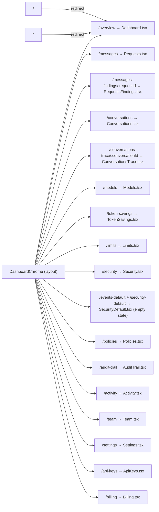
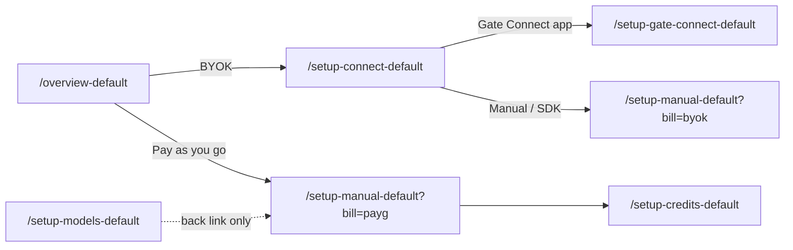
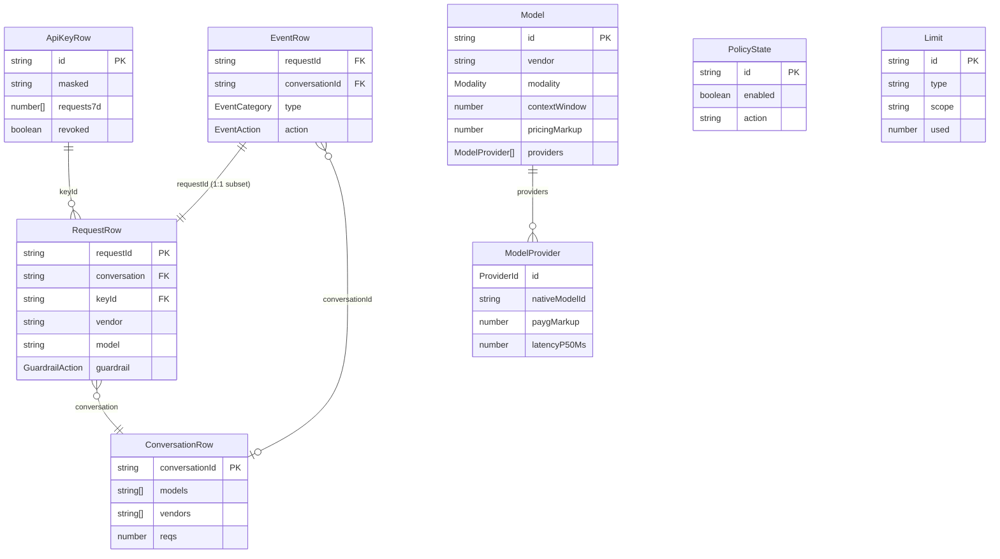
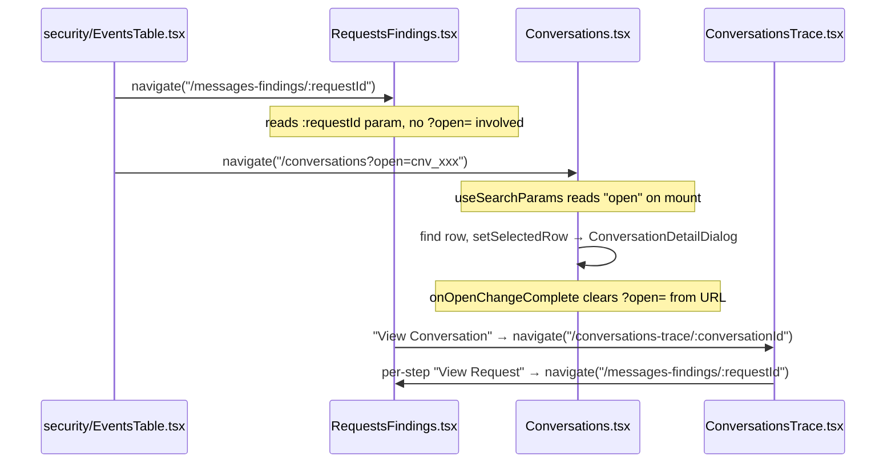

# Constellation Gate AI — Dashboard Architecture

> **Scope:** This file documents the architecture of the **Gate AI dashboard** (`gate-ai-build` repo) — its pages, routing, TypeScript types, mock data model, entity relationships, cross-page deep-links, design system, and component library. Update it when the page surface, data model, or design system changes.

---

## 1. Stack

| Layer | Tech | Version |
| --- | --- | --- |
| Framework | React + Vite | 19.2.5 / 8.0.10 |
| Routing | react-router-dom | 7.3.0 |
| Styling | Tailwind v4 (`@tailwindcss/vite`) | 4.2.4 |
| Headless UI | `@base-ui/react` | 1.4.1 |
| Charts | recharts | 3.8.0 |
| Icons | lucide-react | 1.14.0 |
| Font | Geist (variable) | 5.2.8 |
| Toasts | sonner | 2.0.7 |
| Calendar | react-day-picker | v10 |
| Animation | tw-animate-css | 1.4.0 |
| Language | TypeScript | ~6.0.2 |

**No backend.** All data is mock — embedded seed arrays and deterministic generators in each page file. No dark mode (intentionally absent).

---

## 2. Routing & Navigation

### Route map



- The graph shows the **PRO** surfaces only. `App.tsx` declares 54 paths in
  total: nearly every nav base also has a `-default` and a `-free` twin, and
  five `/setup-*-default` pages carry the onboarding flow. Both sets are
  inventoried under "Tier & onboarding variants" below.
- Default route: the layout's `index` route and `*` both redirect to `/overview`.
- Auth routes (`/sign-in`, `/sign-up`) render under `AuthLayout`, outside `DashboardChrome`.
- All routes share `DashboardChrome` as their layout wrapper.
- Every page component is `lazy()`-imported in `App.tsx` behind a `Suspense`
  boundary, so adding a page adds a chunk, not weight to the entry bundle.
- Sidebar expand/collapse state lives in `App.tsx` with `localStorage` persistence; passed to pages via `useOutletContext<{ sidebarExpanded: boolean; toggleSidebar: () => void }>()`.

### Chrome shell layout

`DashboardChrome` composes a flex row of three columns: the persistent nav
rail (`lg+`, hidden below — `w-59`/236px expanded, `w-16`/64px collapsed), the
main column (top bar + scrollable `<main>` content), and — added 2026-07-27 —
the **Ask AI docked panel** on the right.

- **Ask AI panel.** Toggled by the "Ask AI" top-bar button (left of Docs) and
  by the panel's own collapse control; both flip a chrome-internal `askAiOpen`
  state (`useState`, not part of the public `DashboardChromeProps`).
  `AskAiPanel` (`src/components/ui/ask-ai-panel.tsx`) owns the panel layout:
  header ("New session" trigger + `SquarePen` + `PanelRightClose` collapse)
  over a `px-4 pb-4` body that stacks the scrolling message region (`pt-4`) —
  `AskAiEmptyState` until the first send, then `MessageThread` +
  `AskAiThinkingRow`, with `ScrollToLatestFab` pinned over it — above
  `AskAiComposer`
  (`src/components/ui/ask-ai-composer.tsx`) — the chat box, built to Figma
  node `1125:5376`: `bg-card-muted` shell, 16px padding, 8px radius,
  `focus-within:border-primary`, a `field-sizing-content` textarea that grows
  1 → 4 lines of the 14/20 `type-copy-14` leading then scrolls, and a
  32px action row: a 24px `Plus` "Add context" (still unwired) left, and one
  32px circle right that carries two roles — `Send` at rest, `Square` "Stop
  replying" while the agent works, wired through `onSend` / `onStop` to
  `useAskAiThread`. At `lg+` it is a third flex
  sibling that animates its
  width `0 → 368px` (`transition-[width]`, `var(--ease-out)`, 300ms) so the top
  bar and content condense in step; below `lg` the same shell opens in a
  right-docked `Sheet`. The `FeedbackFab` shifts left with the panel
  (`right-6 → lg:right-[392px]`) on the same curve.
- **Container-query content pane.** `<main>` carries `@container`
  (`container-type: inline-size`), so page grids can respond to the actual
  content width — which already nets out both the rail and the panel — via
  **container** variants (`@sm`/`@lg`/`@2xl`/`@4xl`…) instead of viewport
  breakpoints. This is the convention for making content "collapse earlier" when
  the panel or rail eats horizontal space. Thresholds are container-width values
  (`@lg` = 512px, not the 1024px viewport `lg`), so conversion is not a 1:1
  rename — pick each per real content width. Overview is converted first (see
  §6); other content pages follow the same pattern.

### Sidebar navigation

Five sections defined in `src/layouts/nav-sections.ts` → `SIDEBAR_SECTIONS`.
Each item is `{ id, icon, label, pageId?, locked? }` — `pageId` holds the URL
path handed straight to `navigate()`; an item without one is an inert
affordance.

| Section | Nav items (id → pageId) |
| --- | --- |
| _(unnamed)_ | overview → `/overview` |
| Monitor | requests → `/messages` (label "Messages"), conversations → `/conversations`, security-events → `/security` _(`locked`)_, audit-trail → `/audit-trail` |
| Manage | policies → `/policies`, limits → `/limits` _(`locked`)_, token-savings → `/token-savings` _(`locked`)_ |
| Gateway | models → `/models` |
| Workspace | activity → `/activity`, team → `/team`, billing → `/billing`, api-keys → `/api-keys`, notifications → `/notifications`, settings → `/settings` |

Each page passes its own `activeNavId` string to `<DashboardChrome>` to mark the correct sidebar item active.

The two variant sidebars are **derived**, not hand-maintained:
`buildVariantSections(suffix, lockedIds, labelOverrides)` maps
`SIDEBAR_SECTIONS`, rewriting each `pageId` to `${pageId}${suffix}`.

- `FREE_SIDEBAR_SECTIONS` — suffix `-free`, `lockedIds = LOCKED_IN_FREE`.
- `DEFAULT_SIDEBAR_SECTIONS` — suffix `-default`, empty lock set. The nav label
  stays "Messages" across all tiers; only the Default page body keeps the
  "Requests" copy.

**Upgrade promo (2026-08-04).** `SidebarPanel` renders a `<SidebarUpgradeCard>`
between the `<nav>` and the user area when — and only when — it receives an
`upgradePath`. `DashboardChrome` derives that path from the same tier signal as
the nav locks (`lib/plan.ts`): `/billing-default?manage=1` on `-default`
surfaces, `/billing-free?manage=1` on `-free`, and `undefined` on PRO, where the
card does not render at all. It lands on that tier's OWN Billing page, never the
PRO one, so the CTA cannot jump the user across workspaces, and `?manage=1`
opens the plan-comparison dialog on arrival (§7) so one click reaches the plan
picker instead of dropping the user on the page to hunt for the button. The prop
threads to both `SidebarPanel` mounts — the desktop
rail via `<Sidebar>`, and the mobile Sheet via `DashTopBar → MobileNav` — so
the two never drift. The collapsed 64px rail has no variant of it.

### Tier & onboarding variants

Nearly every sidebar page has two standalone route twins beside its PRO route
(same chrome, different content state). Naming contract:

- `*Default.tsx` on `/<base>-default` — the page as a NEW workspace sees it:
  empty-state hero, zeroed KPI cards, and `TableEmptyState` in place of each
  table.
- `*Free.tsx` on `/<base>-free` — the page as a FREE-tier workspace sees it:
  feature gated, upgrade CTA.

**Twin inventory.** Both suffix sets cover the same 15 nav bases —
`/overview`, `/messages`, `/conversations`, `/models`, `/token-savings`,
`/limits`, `/security`, `/policies`, `/audit-trail`, `/activity`,
`/team`, `/billing`, `/api-keys`, `/notifications`, `/settings` — with two spelling quirks: the
Security `-default` twin answers on **both** `/events-default` and
`/security-default` (same `SecurityDefault.tsx`), and `/messages-*` twins
render `Requests*.tsx` because the route was renamed but the components were
not. (An Alerts page lived at `/alerts` from 2026-08-05 until its removal on
2026-08-24, superseded by the My Notifications + Limits-alerts plan.)

**`src/lib/plan.ts` is the single source of truth for tier.** A surface is
non-PRO when its pathname ends in `-default` or `-free` (`FREE_SURFACE`), which
means tier is derived from the URL, never stored:

| Export | Use |
| --- | --- |
| `isDefaultSurface` / `isFreeSurface` / `isNonProSurface` | Predicates read by the sidebar lock icons and the workspace badge, so the badge and the locks can never disagree |
| `FREE_TWINS` / `DEFAULT_TWINS` | The nav bases that actually have a twin |
| `toProPath` / `toFreePath` / `toDefaultPath` | Path translation between tiers. Idempotent within a tier; each falls back to that tier's `/overview` twin when the current base has none |

**There IS a runtime tier switch (2026-06-16).** `WorkspaceSwitcher` in the top
bar renders Pro / Default / Free menu items that `navigate()` the _current_
pathname through those translators, so switching tier keeps you on the page you
were reading. The plan `Badge` next to the workspace name reads from the same
predicates. Direct-route entry still works, and remains how a single state gets
designed or reviewed in isolation.

- `locked: true` in `nav-sections.ts` renders the sidebar lock icon on the
  PRODUCTION shell for the three Pro surfaces (Security Events, Limits, Token
  Savings). Note that `LOCKED_IN_FREE` is currently an **empty set**, so the
  Free sidebar locks nothing — every item routes to its `-free` twin instead.
- `/upgrade` is the plan-comparison page the upsell CTAs link to.

**Onboarding flow (`/setup-*-default`, added 2026-06-25).** Five pages reached
from the `/overview-default` get-started card, forking on billing model:



- `SetupConnect` — "Pick how to connect": the two ways to route plans you
  already pay for.
- `SetupGateConnect` — download the app, create a key, send the first request.
  Back → `/setup-connect-default`.
- `SetupManual` — one page, two billing modes off `?bill=byok|payg` (see §7).
  The mode drives title, subtitle, context strip, and the back target
  (Connect options for BYOK, Overview for PAYG).
- `SetupCredits` — credit-balance top-up for pay-as-you-go. Back →
  `/setup-manual-default?bill=payg`.
- `SetupModels` — pooled pay-as-you-go pricing per 1M tokens, catalog-derived
  (§3.6a). Its back link points at `/setup-manual-default?bill=payg`, but
  **nothing in `src/` navigates TO it** — like the two params in §7 it is an
  orphaned entry point: re-link it or retire it deliberately.

---

## 3. TypeScript Type System

Most types live inline in their page file, but shared primitives and heavy data now live in dedicated modules: time-range types in `src/lib/range.ts`, the model catalog in `src/data/models.ts`, and the Conversations types in `src/pages/conversations/types.ts` (imported by the page, its component modules, and the data layer; this replaced the former page/data-module type cycle). Page-specific types still live inline and are reused by importing from the defining page.

### 3.1 Shared primitive types

```typescript
// Time-range filtering. Defined in src/lib/range.ts, shared by Activity/Conversations/Security.
// Exports: PresetRange, Range, CustomRange, RANGE_OPTIONS, RANGE_SCALE, daysInRange, effectiveScale
type PresetRange = 'all' | '24h' | '7d' | '30d'
type Range       = PresetRange | 'custom'
type CustomRange = { from: Date; to: Date }
type EventsRange = PresetRange | 'custom'

// Vendor & provider dimensions — two independent axes. `Vendor` is who
// CREATED the model; `ProviderId` is which gateway upstream SERVES it.
type Vendor = 'anthropic' | 'xai' | 'google' | 'openai' | 'meta' | 'mistral' | 'deepseek' | 'cohere' | 'moonshotai' | 'qwen'
type ProviderId = 'alibaba' | 'vertex' | 'openrouter'

// Response statuses
type ResponseStatus  = 'success' | 'error'
type GuardrailAction = 'allow' | 'flagged' | 'redacted' | 'block'
type GuardrailReason = 'injection' | 'pii' | 'credential'
type EventAction     = 'blocked' | 'flagged' | 'redacted'
type EventCategory   = 'injection' | 'pii' | 'phi' | 'credential'
```

### 3.2 API Keys

```typescript
// Defined in: src/data/api-keys.ts (lifted out of ApiKeys.tsx 2026-08-24 so
// the notifications feed can read the seed without importing the page chunk)
interface ApiKeyRow {
  id:          string          // "sk-gw-c4aeb3a8" — full id, matching/dedup
  name:        string          // "prod-web", "prod-agent", …
  masked:      string          // "sk-gw-…c4ae" — display-only
  requests7d:  number[]        // 7-element sparkline
  createdAt:   Date
  lastUsed:    Date | null     // null = never used
  revoked?:    boolean
}
```

Canonical seed: `API_KEY_SEED_ROWS`, 4 keys (prod-web, prod-agent,
design-agent active; test-key revoked). The page seeds
`useState(API_KEY_SEED_ROWS)` and still owns mutation. Named to avoid
`activity-data.ts`, which exports a DIFFERENT `ApiKeyRow`/`API_KEY_ROWS` pair
for the Activity usage tables. Revoked keys are filtered out of every scope dropdown, key picker, and limit target across the app — "all my keys" = active keys only.

### 3.3 Requests (Messages page)

```typescript
// Defined in: src/pages/requests/types.ts
interface RequestRow {
  day:             string
  time:            string
  relative:        string
  status:          ResponseStatus
  guardrail:       GuardrailAction
  code:            number
  vendor:          Vendor
  model:           string         // canonical catalog id, `vendor/model`
  conversation:    string         // conversationId cross-link
  keyId:           string
  inTokens:        number
  outTokens:       number
  latency:         number
  slow?:           boolean
  cost:            number
  guardrailReason?: GuardrailReason
  requestId?:      string         // UUID v4; links Security events → this request
  summary?:        string         // authored trace-step label
  toolName?:       string         // tool-call rows; args live in request-bodies
}
```

`model` is the canonical `@/data/models` id (`anthropic/claude-opus-4-8`) —
the same string the gateway takes as a handle. It is **not** a display name:
surfaces render `modelName(row.model)` and keep the id visible as the mono
sub-line. See §3.6a.

**`requestId` is a UUID v4, not a `req_*` string (changed 2026-08-19).**
Grounded in gate-main: `gateway_requests.request_id` is a `text` column
(`packages/database/src/entities/gateway-request.entity.ts`) filled by
`randomUUID()` in `apps/gateway-proxy/src/proxy/proxy.service.ts`
`createContext()`. There is no prefix and no `x-request-id` header override.
`req_*` is a **display shortening**, applied by gate-main's
`shortRequestId()` (`dashboard-web/src/pages/Conversations.tsx`) as `req_` +
6 hex; the Messages detail modal shows the full raw UUID. Storing the
abbreviation as the value was backwards, so 123 authored ids and the 102
matching `REQUEST_BODIES` keys were migrated in lockstep to deterministic
UUID-shaped dummy values. Body keys are now **quoted** — a UUID is not a bare
identifier. The 8 `req_*` occurrences inside `SHARED_TRANSCRIPT_*` blobs are
illustrative code samples and were left alone.

Three helpers in `src/data/requests.ts`, all tested:

| Helper | Returns | Used by |
| --- | --- | --- |
| `requestRowId(row)` | full UUID (authored, else derived) | routing, `/messages-findings/:id`, body lookup |
| `requestIdLabel(id)` | first two segments, `xxxxxxxx-xxxx` | the Messages table row |
| `shortRequestId(id)` | `req_` + 6 hex — mirrors gate-main | space-constrained surfaces |

The derived branch seeds on conversation + code + day + time + model + key +
tokens + latency, **not** conversation + code alone. The old
`req_${conv8}${code}` fallback collided on every row of a session sharing a
status code: 153 rows produced 133 distinct ids, leaving 20 rows unreachable
at `/messages-findings/:id` (they resolved to whichever row `find()` hit
first). A uniqueness test pins this, and a second test pins that truncating
to two segments does not reintroduce the collision.

`cnv_*` needs no such change — it already matches gate-main's
`conversationLabel()`: `cnv_` + 8 hex off the session UUID.

### 3.4 Security Events

```typescript
// Defined in: src/pages/Security.tsx
interface EventRow extends RequestRow {
  type:           EventCategory
  key:            string
  action:         EventAction
  requestId:      string          // cross-link → /messages-findings/:requestId
  conversationId?: string         // cross-link → /conversations-trace/:conversationId
  keyTier:        string
}
```

### 3.5 Conversations

```typescript
// Defined in: src/pages/conversations/types.ts (also TraceEvent, TraceStatus, TraceRenderItem, ConversationMessage)
type ConversationStatus = 'active' | 'completed' | 'failed'

interface ConversationRow {
  title:          string
  conversationId: string          // cross-link from Security / Messages
  initiator:      string
  turns:          number
  reqs:           number          // count of RequestRows referencing this
  vendors:        Vendor[]        // DERIVED from the owned rows
  models:         string[]        // DERIVED — canonical catalog ids
  inTokens:       number
  outTokens:      number
  cost:           number
  status:         ConversationStatus
  updated:        Date
  duration:       string
}
```

`vendors` / `models` joined `reqs`, `inTokens`, `outTokens`, `cost` and
`status` as fields `getConversationView()` re-derives from the conversation's
own request rows (2026-08-03). The authored values on `CONVERSATION_ROWS` are
the fallback for a conversation that owns no rows, and are written to match
the derivation; `models-catalog.test.ts` asserts the two stay equal. The
hand-maintained `ModelId` union that used to type `models` is gone — it was a
second, independent claim about which models a conversation ran, and it had
drifted from the rows on 7 of 8 conversations.

```typescript
interface ConversationMessage {
  role:       MessageRole      // 'system' | 'user' | 'tool' | 'assistant'
  tool?:      string           // tool name — only on role 'tool' (the RESULT)
  body:       React.ReactNode  // null on a call-only assistant turn
  time:       string
  requestId?: string           // cross-link key into TraceEvent
  toolCalls?: ConversationToolCall[]   // only on role 'assistant' (the INPUT)
}

// One tool invocation on an assistant turn. Array so a turn can carry several
// calls; the captured data yields exactly one per request today.
interface ConversationToolCall {
  name: string   // = RequestRow.toolName
  args: string   // = getRequestBody(row).toolArgs, "<name>: " prefix stripped
}
```

**`toolCalls` derivation (`src/data/conversationDetail.ts`, scripted branch).**
For every request row carrying `toolName`, one call is built: `name` from
`row.toolName`, `args` from `getRequestBody(row).toolArgs` with the redundant
leading `"<name>: "` prefix removed (88 of the 89 captures carry it; the render
surface already names the tool). Args are otherwise **verbatim** — no wrapping,
re-indenting, or JSON envelope, since 76 of the 88 are bare shell commands.

The call hangs off the **assistant** message, not the `tool` message: the model
is what asked for it, and the `role: 'tool'` message that follows carries the
**result**. Consequence — a row with a tool but no captured `assistantResponse`
now still emits an assistant message (body `null`, `toolCalls` set). That moves
the scripted conversation from **43 → 100 assistant messages** and takes
orphaned tool calls from 57 → 0. The Messages panel's "N turns" counter reads
that same set and rises with it. The unscripted fallback branch is untouched.

### 3.6 Models & Providers

Rebuilt 2026-08-03 from the live production API (`GET /api/v1/available-models`,
gate-v1.27.1) — the 25 models prod's page 1 renders, in its "Most popular"
order. The previous invented 23-model / 14-provider catalog is gone, along with
the First-party / Marketplace split, which does not exist in prod.

```typescript
// Defined in: src/data/models.ts (MODELS catalog, types, formatters, sort, MODEL_OPTIONS)

// Every model in prod's catalog is text. The former 'embeddings' | 'audio' |
// 'rerank' members went with the invented catalog; the tab strip is
// "All types" + "Text".
type Modality   = 'text'

// 11 of the API's 13 capability flags. `systemMessages` and
// `parallelToolCalls` are exposed by the API but have no icon in the table.
type Capability = 'tools' | 'vision' | 'reasoning' | 'promptCaching'
                | 'responseSchema' | 'streaming' | 'webSearch'
                | 'audioInput' | 'pdfInput' | 'videoInput' | 'audioOutput'

type ModelSort  = 'popular' | 'newest' | 'cheapest' | 'largest-context'

interface ModelPricing {
  inputPer1M:             number
  outputPer1M:            number
  cachedInputReadPer1M:   number | null
  cachedInputWritePer1M:  number | null
}

interface ModelProvider {
  id:            ProviderId
  nativeModelId: string        // what the upstream calls it
  paygMarkup:    number        // openrouter 1.1, alibaba/vertex 1.0
  latencyP50Ms:  number | null // null until the model is actually called
  throughputTps: number | null
  sampleCount:   number
}

interface Model {
  id:             string       // canonical `vendor/model` — this IS the handle
  vendor:         Vendor
  name:           string
  description:    string
  modality:       Modality
  contextWindow:  number | null // null on Qwen3 Next; renders as an em dash
  maxOutputTokens:number | null
  pricing:        ModelPricing
  pricingMarkup:  number        // 1.1 on the two DeepSeek rows, else 1
  capabilities:   Capability[]
  releasedAt:     string | null // only 3 of 25 have one
  providers:      ModelProvider[]
}
```

**25 models across 5 vendors** (`anthropic` 11, `google` 10, `deepseek` 2,
`qwen` 1, `moonshotai` 1) served by **3 providers**. `openai`, `meta`,
`mistral`, `xai`, and `cohere` are not in the catalog. After the model
reconciliation later on 2026-08-03 (§3.6a) only `openai` still keys anything —
the BYOK "works with a ChatGPT subscription" surfaces on DashboardDefault. The
other four are unreferenced and stay in `Vendor` / `VENDOR_META` deliberately;
removing them is one edit there plus `VENDOR_ENDPOINT` (a `Record<Vendor,
string>`, so the two move together) and costs nothing to defer.

Provider distribution: OpenRouter 25/25, Google Vertex 23/25, Alibaba 3/25 (the
Qwen row and both DeepSeek rows). Vertex is absent only from the two DeepSeek
rows. `TOTAL_PROVIDERS` derives from the catalog and lands on 3.

**Prices are derived in two stages, never stored twice.** The list table shows
`pricing.X × pricingMarkup`; each provider row on the detail page shows that
list price × its own `paygMarkup`, which is why OpenRouter's row reads 10%
above Vertex's on the same model and carries a `+10%` badge computed from the
same number.

**Display strings mirror prod verbatim, including its apparent
inconsistencies.** Anthropic reports a decimal 1,000,000 context and renders
`1M`; Google and DeepSeek report a binary 1,048,576 and render `1.0M`. Same
`formatTokenCount`, different inputs. Sorting runs on the raw numbers, so
`1.0M` correctly outranks `1M`.

### 3.6a The catalog is the only place a model is introduced

Reconciled 2026-08-03, immediately after the catalog rebuild above. The rebuild
left Messages, Conversations, Activity and Setup each describing a different
fleet: 35 of 153 request rows named models that had stopped existing, Activity
charted four more that never existed anywhere, and the Setup pricing page
quoted rates for GPT-5.2, o4, Grok 4 and Llama 4 Maverick. Each surface carried
its own spelling and nothing checked them against anything.

**The contract now:**

- A model is referenced everywhere by its canonical `vendor/model` id — the
  gateway handle, and the `Model.id` in `data/models.ts`.
- The human label is read back with `modelName(id)`. No surface re-types a
  model name.
- `data/models.ts` exports the lookup (`modelById`, `modelName`, `MODEL_IDS`)
  and the one curated id list a page needs (`PAYG_PRICING_MODEL_IDS`).
- Filter dropdowns derive from `MODEL_OPTIONS`, narrowed to the models that
  actually carry rows, so an option can never return an empty table.
- `src/data/models-catalog.test.ts` asserts all of it: every request row,
  conversation (seed _and_ derived), trace step, filter option, Activity series
  and Setup price row resolves to a catalog id with the catalog's vendor and
  the catalog's name.

The remap applied to the 35 orphaned rows, chosen to hold the "one gateway,
many vendors" story with real models:

| Retired | Rows | Now |
| --- | --- | --- |
| `claude-sonnet-4.8` | 10 | `anthropic/claude-sonnet-5` |
| `gemini-3-pro` | 9 | `google/gemini-3-1-pro-preview` |
| `gpt-5.1` | 6 | `deepseek/deepseek-v4-pro` |
| `llama-4.2-405b` | 4 | `qwen/qwen3-next-80b-a3b-instruct` |
| `grok-4.1-fast` | 3 | `deepseek/deepseek-v4-flash` |
| `mistral-large-3` | 3 | `moonshotai/kimi-k2-thinking` |

The other 118 rows already named catalog models and only needed the
vendor-namespaced, dashed form. **No transcript was edited** — `REQUEST_BODIES`
is keyed by request id, so a row's captured body cannot detach from it.

**Rendering:** Messages' Model cell and the request detail's Model row show the
catalog name over the canonical id (`type-label-14` / `type-mono-12`), the same
two-line shape the Conversation cell uses and the same split prod draws across
its Model / Model ID columns. Overview's compact preview shows the name only.

### 3.7 Policies & Limits

```typescript
// Defined in: src/pages/policies/config.ts
interface ActionOption {
  value:       string
  name:        string
  flag?:       'DEFAULT'
  description: string
}

interface PolicyConfig {
  id:            string
  name:          string
  scanTag:       string
  icon:          string
  description:   string
  sensitivity?:  string
  scanDirection?: string
  action: { helper: string; options: ActionOption[] }
}

interface PolicyState {
  id:             string
  enabled:        boolean
  sensitivity?:   string
  scanDirection?: string
  action:         string
}

// Defined in: src/pages/Limits.tsx
interface Limit {
  id:        string
  name:      string
  type:      string           // 'spend' | 'tokens' | 'requests'
  threshold: number
  period:    string           // '1h' | '1d' | '1w' | '1mo'
  scope:     string           // org-wide, project-level, key-level
  used:      number
}
```

### 3.8 UI component types

```typescript
// Defined in: src/components/ui/code-card.tsx
type CodeTone   = 'default' | 'muted' | 'keyword' | 'string' | 'variable' | 'property' | 'punctuation'
type CodeToken  = { text: string; tone?: CodeTone }
type CodeLine   = CodeToken[]

// Defined in: src/components/ui/message-block.tsx
type MessageRole = 'system' | 'user' | 'tool' | 'assistant'

// Defined in: src/components/ui/chart.tsx (recharts wrapper)
type ChartConfig = Record<string, { label?: ReactNode; icon?: ComponentType } & ({ color: string } | { ... })>

// Defined in: src/hooks/use-table-sort.ts (table click-to-sort, 2026-06-04)
type SortDir   = 'asc' | 'desc'
type SortState = { key: string | null; dir: SortDir }   // key=null → unsorted (default order)
// useTableSort(initial?) → { sort, toggle }; sortRows(rows, sort, getValue); parseNumeric(str)
```

### 3.9 Vendor metadata

```typescript
// Defined in: src/components/icons/vendor-meta.tsx
interface VendorMeta {
  color: string      // brand hex for standalone SVG rendering
  icon:  ComponentType
  label: string
}
interface ProviderMeta {
  color:       string
  icon:        ComponentType
  label:       string   // row cells + the providers-stack label  ("Google Vertex")
  filterLabel: string   // the "All providers" dropdown           ("Alibaba Direct")
  detailLabel: string   // the detail page's providers table      ("Google Vertex AI")
}

// VENDOR_META: Record<Vendor, VendorMeta>
// Vendors: anthropic, xai, google, openai, meta, mistral, deepseek, cohere,
//          moonshotai, qwen
// PROVIDER_META: Record<ProviderId, ProviderMeta>   (alibaba, vertex, openrouter)
// PROVIDER_ORDER: ProviderId[]                      (dropdown order, alphabetical)
//
// Three label fields because prod uses three different strings for the same
// provider and all three are real. Renamed from MarketplaceMeta /
// MARKETPLACE_META on 2026-08-03 — the First-party / Marketplace split it
// named does not exist in prod.
```

### 3.10 Notifications (bell feed)

```typescript
// Defined in: src/data/notifications.ts (2026-08-24, notifications PRD phase 1)
type NotificationKind = 'security' | 'message' | 'billing' | 'api-key' | 'team';

type NotificationItem = {
  id:        string;   // "n-<kind>-<source row id>" — traces to a real row
  kind:      NotificationKind;
  title:     string;   // PRD catalog naming ("Security event", "API key created", …)
  copy:      string;
  at:        Date;
  href:      string;   // deep link to the fired thing
  unread:    boolean;  // static default; the menu layers runtime read state on top
  Icon:      IconType;
  iconColor?: string;  // var(--color-*), inline-styled — security items only
};
```

**Everything derives** (no synthetic data). `NOTIFICATION_HISTORY` (38
items, uncapped, newest-first) is one item per real entity row: every
security event (`security-data.ts EVENT_ROWS`, per-category icon/color from
`TYPE_META`, href `/security?open=<requestId>`), the guardrail-touched recent
messages (`REQUEST_ROWS_RECENT`, href `/messages-findings/<requestRowId(row)>`
— the UUID, never the `req_*` display id), every key mint
(`API_KEY_SEED_ROWS` → `/api-keys`; revokes carry no date so they stay out),
every top-up (`HISTORY_ROWS` → `/billing`), and every non-owner join
(`src/data/team-members.ts MEMBER_ROWS` → `/team`). Unread defaults: the
2026-06-06 band ships unread (~15 items); older history ships read.
`NOTIFICATION_ITEMS = NOTIFICATION_HISTORY.slice(0, NOTIFICATIONS_CAP=8)` is
the bell's peek — one array, shared ids, shared read state by construction.

**Read state is in-memory, demo-lifecycle** (`src/data/notifications-store.ts`,
range-store pattern + `useSyncExternalStore`): `{readIds, archivedIds}` Sets,
mutators `markRead` / `markAllRead` / `archiveOne` / `archiveAll` (archiving
implies read — both archive mutators union `readIds`). NO localStorage:
state survives SPA navigation (module scope) and resets on refresh so the
unread flow can be re-demoed. Read/unread renders Gmail-style: whole-row
`text-foreground` (unread) vs `text-muted-foreground` (read), no row dots;
only the bell button keeps a corner dot (`bg-destructive`).

**The preference model is separate** (`src/data/notification-catalog.ts`):
the PRD §4 catalog (13 types, 5 groups, default-on flags), channel prefs,
email frequency, security scope, and the org catalog. Prefs DO persist —
localStorage `notifications.prefs.v1` — unlike read state.

`NOTIFICATIONS_NOW` (2026-06-06 18:30:12, the design-agent key's `lastUsed` —
the latest instant in the mock data) is the feed's clock; relative labels
render via `fmtRelative(at, NOTIFICATIONS_NOW)` from `@/data/audit-trail`
(anchor param added for this). Catalog types without backing rows
(spend-limit-reached, payment-failed, PAYG-low — auto-recharge threshold is
0) stay out until the My Notifications page phase.
`notifications.test.ts` pins id uniqueness (whole history), the bell cap and
its slice relation to the history, newest-first order, `at <=
NOTIFICATIONS_NOW`, kind/`KIND_META` completeness, and that every href
resolves (security `?open=` ids exist; message params survive the
RequestsFindings lookup).

---

## 4. Entity Relationships



**Key coupling rules:**

- `EventRow` is a subset of `RequestRow` — security events are exactly 0.25× request volume across all ranges (24h: 12 = 0.25×48; 7d: 117 ≈ 0.25×468; 30d: 562 ≈ 0.25×2,248; all: 1215 ≈ 0.25×4,860).
- `ConversationRow.reqs` counts how many `RequestRow` entries reference that `conversationId`.
- `ApiKeyRow.requests7d` sparkline must stay consistent with `API_KEY_ROWS` in Activity.

---

## 5. Mock Data Architecture

> **2026-06-10 extraction:** cross-page mock data no longer lives inside page
> components. `src/data/requests.ts` (REQUEST_ROWS_* + the findings model +
> `requestRowId` + `getEventFindingCopy`), `src/data/conversations.ts`
> (CONVERSATION_ROWS), and `src/data/audit-trail.ts` (NOW, EVENT_ROWS,
> KIND_BADGE_VARIANT, fmtRelative, truncateHex) are the owners. Row TYPES stay
> with their pages (`RequestRow` in Requests.tsx etc.); the data modules
> import them type-only, so there are no runtime cycles. Data invariants are
> enforced by Vitest (`src/**/*.test.ts`, run in CI).

The app has no backend. All data is seeded in-file. The three rules:

1. **Single source of truth.** KPI tiles, chart bars, descriptions, and breakdowns all derive from one constant or generator function. Never hardcode the same number in two places.
2. **Deterministic LCG seeding.** Bucket/sparkline distributions use a linear congruential generator so they look realistic but reproduce exactly.
3. **Cross-page consistency.** Event totals = 0.25× request totals. Range scaling uses a shared `RANGE_SCALE` multiplier. Model/vendor distribution matches across pages.

### 5.1 Canonical totals

| Page | Constant | Value |
| --- | --- | --- |
| Requests | `HERO_ALL_TOTAL` | 4,860 |
| Requests | `HERO_VIEWS['24h'].total` | 48 |
| Requests | `HERO_VIEWS['7d'].total` | 468 |
| Requests | `HERO_VIEWS['30d'].total` | 2,248 |
| Security | `EVENTS_RANGE_TOTAL['all']` | 1,215 |
| Security | `EVENTS_RANGE_TOTAL['7d']` | 117 |
| Activity | `TOTAL_7D_BASE_DOLLARS` | $247.59 (derived) |
| Activity | `TOTAL_7D_BASE_REQUESTS` | 63,793 |
| Activity | `TOTAL_7D_BASE_TOKENS` | 73,450,000 (derived) |

Only `HERO_ALL_TOTAL` is a standalone const; the other three per-range totals
are literals inside the `HERO_VIEWS` record in `src/pages/requests/hero-data.ts`
(the old `HERO_24H_TOTAL` / `HERO_7D_TOTAL` / `HERO_30D_TOTAL` names are gone).

`TOTAL_7D_BASE_DOLLARS` and `TOTAL_7D_BASE_TOKENS` are no longer authored — see
§5.1.1. `TOTAL_7D_BASE_REQUESTS` still is, because a request count is not a
function of price.

### 5.1.1 The pricing contract (2026-08-03)

**No dollar figure in this app is authored.** Every `$` is
`costOf(modelId, tokensIn, tokensOut)` from `src/data/models.ts` — catalog list
price × tokens — or a sum of those calls. Tokens are the authored fact; dollars
are what the catalog charges for them. `src/data/pricing.test.ts` pins every
surface.

Before this, spend and tokens had no price relationship anywhere: request rows
were mispriced by 0.48×–14.7×, the Activity Top Models card billed Qwen3 Next at
13× list and Gemini 3.1 Pro at 0.47×, and `activity-data.ts` carried a comment
telling readers not to reconcile spend ÷ tokens against the catalog.

The derivation chain:

```text
data/models.ts          costOf(model, in, out)      ← catalog list price × tokens
                        blendedRate(model, outShare) ← $/1M at a given output mix
   ↓
data/requests.ts        row.cost                     ← per-row costOf, 4dp
   ↓
data/conversationDetail getConversationView().cost   ← sum over the conversation's rows
                        avgCostPerConversation()     ← Conversations "Avg Cost / Conv" KPI
   ↓
data/conversations.ts   CONVERSATION_ROWS seeds      ← written to match the derivation
```

Activity inverts what used to be a hand-authored 3 × 7 × N matrix of daily
dollars. `src/pages/activity-data.ts` now declares the 7d workload as tokens and
derives all money from it:

```text
MODEL_SERIES_7D      per-model 7d tokensIn/tokensOut (authored — the traffic)
PROVIDER_MIX_7D      per-model share across openrouter / vertex / alibaba
KEY_MIX_7D           per-model share across the 5 Gate keys
   ↓  product form → USAGE_7D: one cell per (model, provider, key)
   ↓  cell.spend = costOf(model, in, out) × that route's catalog paygMarkup
SPEND_TOTALS_7D · TOKENS_TOTALS_7D   grouped by dimension
TOTAL_7D_BASE_DOLLARS · TOTAL_7D_BASE_TOKENS   summed
SPEND_BASE           per-day = DAY_SHAPE_7D weight × each series' 7d total
MODEL_ROWS.spend · API_KEY_ROWS.spend          grouped from the same cells
```

Consequences worth knowing:

- **All three dimensions reconcile by construction**, on both metrics and on
  every day, because they group one set of cells and share one day shape. The
  cross-dimension invariant is arithmetic now, not tuning.
- **Routing is catalog-constrained.** Alibaba serves only DeepSeek and Qwen, so
  it carries 11% of tokens and under 2% of dollars — a hairline band on the
  spend lens. That is the finding, not a rendering bug.
- **OpenRouter's +10% PAYG markup** is read per (model, provider) off the
  catalog, which is why its dollar share runs ahead of its token share.
- **BYOK means one thing.** `isByokKey` (`src/data/requests.ts`), a `"—"` cost on
  a request row, and `API_KEY_ROWS.path === "BYOK"` are now equivalent, and the
  test asserts it. `design-agent` moved Gate → BYOK: it was charted at $21.00 of
  spend while all 102 of its request rows were unmetered. It is no longer a
  charted key, so `SPEND_SERIES.apiKey` has 5 entries, not 6.
- **`MODEL_ROWS` authors `tokensPerRequest`, not `requests`.** Request counts
  derive from tokens ÷ call size and rescale onto `TOTAL_7D_BASE_REQUESTS`, so
  the card sums to the KPI rail above it. Gate keys in `API_KEY_ROWS` rescale the
  same way.

### 5.2 Range scaling

```typescript
// src/lib/range.ts (RANGE_SCALE + effectiveScale; shared by Activity + Conversations)
const RANGE_SCALE: Record<PresetRange, number> = {
  '24h': 0.16,
  '7d':  1,
  '30d': 4.2,
  'all': 8.5,
}
```

KPI values for other ranges are derived by multiplying the 7d base by the scale factor. Charts apply the same factor to per-bucket arrays.

### 5.3 Key generators

```typescript
// LCG-based distribution — used in Requests, Security, Activity
function distributeSeries(total: number, count: number, seed: number): number[] {
  let s = (seed * 2654435769) >>> 0 || 1;
  const rand = () => { s = (s * 1664525 + 1013904223) >>> 0; return s / 0xffffffff; };
  // weights: 75% normal, 15% spike, 10% dip. Trend 0.7→1.3.
  // Last bucket absorbs remainder for exact sum.
}

// Security — projects totals onto 31:14:2 ratio (blocked:flagged:redacted)
// Uses largest-remainder algorithm for exact integer sum.
function splitEventMix(total: number): { blocked, flagged, redacted }

// Sparklines (7-point) for API key request history
function buildSpark(total: number, seed: number): number[]
```

### 5.4 Seed arrays

| Array | Page | Shape | Count |
| --- | --- | --- | --- |
| `REQUEST_ROWS` | `src/data/requests.ts` | `RequestRow[]` | 17 (cumulative: 24h ⊂ 7d ⊂ 30d ⊂ all) |
| `EVENT_ROWS` | Security | `EventRow[]` | 17 |
| `CONVERSATION_ROWS` | `src/data/conversations.ts` | `ConversationRow[]` | 8 |
| `SAMPLE_TRACE` | `src/data/conversations.ts` | `TraceEvent[]` | 7 |
| `SECURITY_FEED` | `src/pages/security-feed.ts` | `EventRow[]`, chronological ASC | 48 |
| `MODELS` | `src/data/models.ts` | `Model[]` | 25 |
| `MODEL_ROWS` | `src/pages/activity-data.ts` | usage rows, keyed by catalog id | 7 |
| `API_KEY_ROWS` | Activity | key usage rows | 10 |
| `MEMBER_ROWS` | `src/data/team-members.ts` (lifted from Team.tsx 2026-08-25) | `MemberRow[]` | 4 |
| `INVITATION_ROWS` | Team | `InvitationRow[]` | 2 |
| `POLICIES` | Policies | `PolicyConfig[]` | 3 |
| `API_KEY_SEED_ROWS` | `src/data/api-keys.ts` (lifted from ApiKeys.tsx) | `ApiKeyRow[]` | 4 |
| `HISTORY_ROWS` | `src/data/billing-history.ts` (lifted from Billing.tsx) | `HistoryRow[]` | 6 |
| `NOTIFICATION_HISTORY` | `src/data/notifications.ts` (derived, not authored) | `NotificationItem[]` | 38 |
| `NOTIFICATION_ITEMS` | `src/data/notifications.ts` (= history.slice(0, 8)) | `NotificationItem[]` | 8 |
| `NOTIFICATION_CATALOG` | `src/data/notification-catalog.ts` | `NotificationType[]` | 13 |

Conversation message threads are no longer a static array — `getConversationDetail()`
(`src/data/conversationDetail.ts`) derives `{ trace, messages }` per conversation
id, so the old `CONVERSATION_MESSAGES` const is gone. Overview likewise dropped
its `VOLUME_DATA` / `RECENT_REQUESTS` seeds; it reads `REQUEST_ROWS_RECENT`,
`CONVERSATION_ROWS`, and the Activity series instead (see §6).

`SECURITY_FEED` currently has **no importers** — it fed the SecurityDefault
upsell ticker that was replaced by the empty state. Kept as a ready-made
48-event array; delete it or wire it up rather than letting it rot silently.

**`src/data/redact.ts`** is the single implementation of the PII/credential
masking rule (added 2026-08-19). Any surface that reconstructs captured
message text runs its string through `redactFindings(findings, text, opts)`
before rendering, so a value the gateway caught on ingress is never
re-exposed. Two callers today: `conversationDetail.ts`'s `redactUserBody`
(role-scoped to `user`) and the Messages table's `messagePreview`
(all roles — see §Messages page). Add callers here rather than reimplementing
the loop; two copies that can disagree is exactly the failure this replaced.

---

## 6. Page Inventory

### Overview page (`/overview` → `Dashboard.tsx`)

**Purpose:** Cost, security, and audit anchor rollup across the workspace. Lead surface for both H1 personas (Olivia + Devon); audit feed serves H2 wedge (Grace).

**Sections (top → bottom):**

1. `PageHeader` — `PageTitle` "Overview" + subtitle sourced from Notion H1 Narrative & Positioning ("Cost controls, inline security, and a tamper-evident audit trail. Anchored to Constellation's Digital Evidence layer.")
2. `SectionTitle as="h2"` "Activity This Week"
3. `TokenSavingsStrip` — `KpiRail columns={3}` of three `flat` `CompactKpi` tiles, each with a `CompactSpark` over `KPI_7D_LABELS`. Not click-through:
   - "Messages" — `TOTAL_7D_BASE_REQUESTS`, +8.2%
   - "Tokens saved" — `TOKEN_SAVINGS_RATE_7D` as a percent, +8.7%
   - "Threats detected" — `THREATS_DETECTED_COUNT`, +22.4% (`deltaInverted`)
4. `OverviewUsageChart` — one `Card` whose header carries `DimSelector`
   (By model / By provider / By API key) + a `SegmentedPill` over
   `OVERVIEW_METRIC_OPTIONS` (Tokens / Spend); title flips "Tokens used" ↔
   "Total spent" with the metric. Body is `@4xl:grid-cols-12`:
   `StackedKpiChart` (Recharts `BarChart`, stacked `Bar` per series) beside
   `HorizontalLegend`, which stacks below when narrower.
5. Three `PreviewCard` shells (`density="flush"` Card + title + "View all"
   link, then a shared `<Table>`): "Latest messages" → `/messages` ·
   "Latest conversations" → `/conversations` · "Latest security events" →
   `/security`

**State:** `metric` + `dim` inside `OverviewUsageChart`, both mirrored to the URL (see §7). Nothing else beyond sidebar context.

**Data:**

- `THREATS_DETECTED_COUNT` = 117 — the Security 7d total, and equal to
  `splitEventMix(117)` = 77 blocked + 35 flagged + 5 redacted.
- `DOLLARS_SAVED_7D` = `round(TOKEN_SAVINGS_RATE_7D * TOTAL_7D_BASE_DOLLARS)`
- Series come from `src/pages/activity-data.ts` — `SPEND_SERIES[dim]`,
  `makeStackedTokenRows(dim)`, `makeStackedSpendRows(dim)`. Small series that
  are not in the shared module are built locally with `distributeSeries`
  (`_REQUESTS_7D_SERIES`, `SAVINGS_SPARK`, `THREATS_SPARK`), so every spark's
  buckets sum to its tile's canonical total by construction.
- Preview tables sort desc and `.slice(0, 8)` for the canonical 8-row glance cap.
- The 4-tile click-through KPI rail, `QuickActionsRow`, and
  `RecentAnchoredEventsCard` were removed — Overview no longer touches
  `src/data/audit-trail.ts` or `AuditRecordDialog`.

**Responsive (2026-07-27):** first page converted to container queries (see §2 → Chrome shell layout). Its grids key off the content-pane width rather than the viewport, so they collapse when the Ask AI panel and/or nav rail narrow the content — including the compound worst case (rail expanded + panel open, ~760px). KPI stat rail `@2xl:grid-cols-3` (672px; `sm:grid-cols-1` added at the call site to neutralize the shared `KpiRail` primitive's viewport `sm:grid-cols-3`, primitive untouched). "Tokens used" chart + side legend `@4xl:grid-cols-12` (two-column at 896px, legend stacks below when narrower — also resolves the tablet legend-clip finding). 3-up preview tables `@4xl:grid-cols-3` (held at 896px so rail-expanded 1280–1439 laptops keep 3-col instead of regressing). No change to the panel-closed desktop layout. File: `src/pages/Dashboard.tsx`.

**Cross-page imports:**

- `src/pages/activity-data.ts` → `TOTAL_7D_BASE_REQUESTS`, `TOTAL_7D_BASE_DOLLARS`, `TOKEN_SAVINGS_RATE_7D`, `SPEND_SERIES`, `distributeSeries` (the Activity math moved out of `Activity.tsx` into this module)
- `src/pages/security-data.ts` → `EventRow`, `EVENT_ROWS`, `ACTION_BADGE`, `TYPE_META`, `formatEventTime` (the threat-event detail dialog is file-local in `src/pages/security/EventsTable.tsx`, not a cross-page export)
- `src/data/requests.ts` → `REQUEST_ROWS_RECENT`; `src/pages/Requests.tsx` → `RequestRow` (type-only)
- `src/data/conversations.ts` → `CONVERSATION_ROWS`; `src/pages/conversations/types.ts` → `ConversationRow` (type-only)

---

### Messages page (`/messages` → `Requests.tsx`)

**Purpose:** Full request log. Row-click navigates to the URL-addressable
**Findings page** (`/messages-findings/:requestId`, see next entry). The old
request-detail modal was deleted (2026-07); the row is a real `<a href>` that
routes, and there is no `?open=` deep-link for requests.

**State:**

```typescript
range:       PresetRange         // default 'all'
customRange: CustomRange | null
keyId, model, status, code: string  // filters (committed via the Filters modal)
sort:        SortState              // useTableSort — click-to-sort headers (default unsorted)
page, rowsPerPage: number
```

**Row click:** `navigate('/messages-findings/' + requestRowId(row))` (a real
`<a href>` on the model cell). No `?open=` modal for requests; the detail is
page-only.

**Table:** sortable columns via `<SortableTableHead>` + `requestSortValue(row,key)`
accessor; sorted after filtering. Cost column stays plain (interactive tooltip).

**Message column (added 2026-08-19).** Sits between Model and Conversation and
answers the PRD complaint that a session's hundreds of rows all read the same:
Conversation carries per-_conversation_ identity (title + `cnv_*`, identical on
every row of a session), so Message carries per-_request_ identity — what this
request said, over `requestIdLabel(requestRowId(row))`. Same two-line shape as
Conversation: `type-copy-14` truncating line, `type-mono-12` muted line below.

Text resolution lives in `src/pages/requests/message-preview.ts`, **not** in
`./data`. That module is the only thing on the page needing
`@/data/request-bodies` (~440 KB of transcripts), so keeping it separate stops
the blob from riding along with the row data. RequestsTable wraps
`requestSortValue` locally to add the `message` key for the same reason —
`./data` deliberately has no `message` case.

Resolution order, most specific to least (coverage measured over 153 rows):

| Source | Rows | Why |
| --- | --- | --- |
| `body.userMessage` first line, leading `User:` stripped | 13 | the real user turn |
| `body.toolArgs` first line | 89 | the actual call — already prefixed `Bash:` / `Read:` by the data |
| `row.summary` | ~51 | last resort: for a Bash row it reads `tool: Bash`, which names the tool and says nothing |
| none → em dash + `sr-only` note | 51 | the legacy `cnv_*` sessions carry no body; never fabricate a preview |

**Masking is mandatory on this column.** Whatever text wins is run through
`redactFindings` (`src/data/redact.ts`) before it leaves `messagePreview`.
Four rows leaked real email addresses before this existed — truncation hid
them at the column width, but the DOM and the tooltip carried them in full.
`redact.ts` is the single implementation of the rule, shared with
`conversationDetail.ts`'s `redactUserBody`, so the table, the transcript, and
the request-detail redaction diff cannot disagree. The preview masks findings
of **every** role while the transcript scopes to `user`: the transcript knows
which bubble it is rendering, but this one line can be a user turn OR a tool
call, so role-scoping would leave a hole. `message-preview.test.ts` fails if
any finding's `match` ever reaches a preview again.

Full text stays reachable from the row via the `Tooltip` primitive (the same
one the Time cell uses) rather than a native `title`, which is slow and has no
touch or keyboard path. The trigger is the text span itself, so it adds no tab
stop — the row's only keyboard target remains the drill-in link in the Model
cell.

**Column geometry.** `table-fixed` + `min-w-[1484px]` (narrowed from 1780 in
six measured steps, 2026-08-20; the full history and the measurement method
live in the long comment above the `<Table>` in `RequestsTable.tsx` — trust
that comment, do not re-derive widths by eye). Tokens In/Out merged into one
stacked Tokens column, so the table is 10 columns. The declared percentages
sum to **94, not 100 — deliberate and load-bearing**: `table-fixed` hands the
spare six points back proportionally, and 1484 is exactly the floor at which
an unnarrowed column keeps its pixel width (Time = 9.5/94 × 1484 ≈ 150px).

| Column | % | px @ 1484 | measured need |
| --- | ---: | ---: | ---: |
| Time | 9.5% | 150 | 138 |
| Status | 6.0% | 95 | 92 |
| Security | 6.5% | 103 | 100 |
| Model | 12.0% | 189 | 156 |
| Message | 15.5% | 245 | elastic |
| Conversation | 15.5% | 245 | elastic (401 to stop truncating) |
| Key | 8.5% | 134 | 125 |
| Tokens | 8.5% | 134 | 121 (header-bound) |
| Latency | 6.5% | 103 | 92 |
| Cost | 5.5% | 87 | 74 |

Message and Conversation are the only columns allowed to truncate — they are
the only ones whose content is unbounded. Every value column renders whole at
any width. Row height is a uniform 61px and stays uniform at 1512 / 768 /
613px; the page itself never scrolls sideways, only the table's own
`overflow-x-auto` container.

One known tension, open (the old badge-column tension was resolved by the
2026-08-20 half-point trims; Status and Security now carry +3px, the tightest
margin in the table and spent — do not narrow them further):

- **`min-w-[1484px]` still side-scrolls** inside its container at every
  supported width. Accepted deliberately, but it contradicts the
  Message-column PRD's "table still fits without horizontal scrolling"
  criterion. Fitting the table into the 1226px content column is not a tuning
  problem: the eight non-elastic columns need 898px measured, leaving ~328px
  to split between Message and Conversation.

The stale body-cell widths (`w-48` on Time, `w-28` on the badges, `w-60` on
Model, `max-w-[320px]` on Conversation) were removed — under `table-fixed`
they were inert and only misled.

**Hero views (`HERO_VIEWS`):** Per `RangeKey` spec with total, success/error/slow counts, sparkline data, tick labels.

---

### Requests Findings page (`/messages-findings/:requestId` → `RequestsFindings.tsx`)

**Purpose:** URL-addressable, shareable, multi-tab findings detail for one
request (the GitHub model) — the default row-click target from `/messages`.

**Composition:** reads `:requestId`, finds the row in `REQUEST_ROWS_ALL` via
`requestRowId(row)` (unknown id → "Request not found" alert). Renders
`RequestDetailBodyV2({ row })` from `src/pages/requests/RequestDetailBody.tsx`
(page-only; the old `variant: 'modal' | 'page'` prop and the stored modal were
removed 2026-07). Flows full-width (`-mx-6` cancels the chrome gutter), no
internal scroll, no footer; back breadcrumb (top-left) + "View Conversation"
(top-right).

**Body (`RequestDetailBodyV2`):** title+badge → KPI rail → finding banner → tabs.
Two tabs: **Findings** (left finding list + Passed detectors / right polymorphic
panel: `PiiDetailPanel` for PII/credential, `InjectionDetailPanel` for injection)
and **Details** (Findings-style 2/3 message + 1/3 metadata grid; Message folded
in here, Full request drawer open by default). Panels are file-local to
`RequestDetailBody.tsx`: `PiiDetailPanel`, `InjectionDetailPanel`,
`RequestBodyPanel`, with `PanelHeading` as the shared header. Findings data
contract: `RequestFinding` (`+verdicts?`/`reasoning?`),
`getRequestFindings`/`deriveFinding`, `DETECTOR_CATALOG`, `SHOWCASE_FINDINGS`
(on `req_8f3a1c4`).

**Outbound:** `/conversations-trace/${conversationId}` ("View Conversation").

---

### Conversations page (`/conversations` → `Conversations.tsx`)

**Purpose:** Conversation-grouped view — each row is a multi-request session.

**Modules (2026-07-06 split):** page shell + table in `Conversations.tsx`; detail dialog/body + KPI rail + messages panel in `src/pages/conversations/ConversationDetail.tsx`; request-trace timeline in `src/pages/conversations/RequestTracePanel.tsx`; shared types in `src/pages/conversations/types.ts`.

**State:** Same `range/customRange/keyId/model/page/rowsPerPage` pattern + `selectedRow: ConversationRow | null`.

**Row click:** `navigate('/conversations-trace/${conversationId}')` → the
URL-addressable Trace page (`ConversationsTrace.tsx` → `ConversationDetailBody`).
Legacy `?open=cnv_xxx` opens the `ConversationDetailDialog`, kept for deep-links.

**Detail sections (`ConversationDetailBody`):** ConversationKpiRail (6 tiles) → ConversationMessagesPanel → RequestTracePanel

**Message bubble contents (`messageBody()` in `ConversationDetail.tsx`):** a
`tool` message renders its result through `<ToolResultCode>`; an `assistant`
message renders optional prose followed by one `<ToolCallCard>` per entry in
`message.toolCalls`, stacked at 8px. Both mounts get this — the
`ConversationsTrace` page and the legacy `ConversationDetailDialog` render the
same `ConversationDetailBody`.

**Bubble controls (2026-08-04):** each turn also passes `copyValue` from
`messageCopyText(m)`, which flattens the turn to plain text — prose plus every
`name\nargs` tool call, because the bubble renders those too — and returns `""`
(coerced to `undefined`) for a turn with nothing to copy, so the control is
omitted rather than rendered inert. `MessageBlock` puts copy + expand on the
`↳ requestId` footer row from there (see §9).

**Scroll-body padding:** both panels' scroll bodies are `px-6 py-4` while their
headers stay at 16px; `RequestTracePanel`'s timeline track shifts to x=36px
(24px padding + 12px) to keep the node centerline. The detail title is
"Conversation".

**Cross-panel linking:** `activeRequestId` state shared between Messages and Trace panels for synchronized highlights.

**Outbound:** `/messages-findings/${requestId}` ("View Request" on each trace step)

---

### Security page (`/security` → `Security.tsx`)

**Purpose:** Real-time threat detection log — injection, PII, credential events.

**State:** Same `range/customRange/query/type/keyFilter/action/page/rowsPerPage` + `selectedRow: EventRow | null`.

**Analyst verdict (`e7a08f5`, 2026-08-20):** the events table (section title
"Recent security events") carries a trailing **Status** column whose badge
reflects the verdict set in the event modal. Verdict state lives in
`EventsTableSection`, NOT the dialog body — closing the modal unmounts the
dialog along with the selection, so state set there would be lost. Keyed on
`requestId + type`, because one request can raise two events.

**No incoming deep-link** (Security does not accept `?open=`).

**Outbound links from modal:**

- `/conversations?open=${conversationId}`
- `/messages-findings/${requestId}`

**Data:** `EVENT_MIX = { blocked: 31, flagged: 14, redacted: 2 }` ratio applied via `splitEventMix()` to `EVENTS_RANGE_TOTAL`.

**Modules:** `Security.tsx` (~550: page shell, hero, breakdowns, attack-category cards) ·
`src/pages/security/events-data.ts` (chart/spark math + detail/sort config: `eventsTotal`,
`splitEventMix`, `buildEventsChartView`, `HERO_CHART_CONFIG`, `DETECTION_CHECKS`, `TYPE_DETAILS`,
`getEventDetail`, `EVENT_KEYS`, `eventSortValue` — shared, no JSX) ·
`src/pages/security/EventsTable.tsx` (`EventsTableSection` + file-local threat-event detail dialog).
Row-level `EventRow`/`EVENT_ROWS`/`ACTION_BADGE`/`TYPE_META` still come from `src/pages/security-data.ts`.

---

### Security Default page (`/events-default` + `/security-default` → `SecurityDefault.tsx`)

**Purpose:** The Security Events page as a NEW workspace sees it — nothing has
been captured yet. Both routes render the same component.

**Composition (81 lines, no state, no animation):** `PageHeader` (PageTitle
"Security events" + the same subtitle as the live page) → "Overview" section
with a single "Total events" `Card` whose body is a centered `ShieldCheck`
badge over "No events yet" → "Recent events" section with a
`density="flush"` Card wrapping `TableEmptyState` ("No security events" /
"Prompt injection, PII, and credential leak events flagged by your policies
will appear here.").

**Superseded:** this page used to be a Pro upsell — a `HeroCard` pitch beside a
rotating decorative events ticker, plus a `PlanComparisonDialog`. All of it is
gone; the ticker constants (`SLIDE_MS`, `SLIDE_DELAY`, `FADE_DURATION`,
`ROW_HEIGHT`) no longer exist anywhere in `src/`. The 48-event array that fed
it now sits unused at `src/pages/security-feed.ts` as `SECURITY_FEED` (see
§5.4). `PlanComparisonDialog` still lives at
`src/pages/plan-comparison-dialog.tsx` for the surfaces that do upsell.

---

### Models page (`/models` → `Models.tsx`)

**Purpose:** Routable model catalog with multi-provider offerings and code samples.

**State:**

```typescript
selectedModel: Model | null        // list ↔ detail toggle (no URL change)
modality:      'all' | Modality    // tabs: All types / Text
search, provider: string           // no vendor filter — prod has no such control
sort: ModelSort                    // 'popular' (default) | 'newest' | 'cheapest' | 'largest-context'
page, rowsPerPage: number
```

The detail view is keyed on `selectedModel.id`, so it remounts per model and no
state (expanded description, column sort) can leak between models.

**Detail view sections:** Hero → ModelKpiRail (4 tiles: Context / Max output /
Input / Output) → ProvidersTable (8 columns, `+10%` markup badge, em-dash
telemetry empty state + "No telemetry yet" note when a model has never been
called) → Quick start `PaygToolConfigCard` (4 tools) → CodeCard (TypeScript /
Python / cURL tabs)

---

### Token Savings page (`/token-savings` → `TokenSavings.tsx`)

**Purpose:** Caching and compression metrics and settings.

**State:** `cachingEnabled: boolean`, `ttl: '5m'|'30m'|'1h'|'6h'|'24h'`, `compressionEnabled: boolean`

**Data:** KPI tiles currently hardcoded at "0%" / "$0 saved" (placeholder).

---

### Limits page (`/limits` → `Limits.tsx`)

**Purpose:** Spend / token / request rate caps. (Renamed from "Guardrails" 2026-06-01; the Requests `GuardrailAction` axis in §3.1 is a separate concept and was not touched.)

**State:** `createOpen: boolean`, `limits: Limit[]`

**Dialog fields:** Name, Type (`LIMIT_TYPES`), Threshold, Period (`LIMIT_PERIODS`), Scope (org-wide, key-level)

---

### Policies page (`/policies` → `Policies.tsx`)

**Purpose:** Configure 3 inline security scans: prompt injection, PII/PHI, credential & secrets.

**Modules (2026-07-06 split):** components + `Policies({ variant })` in `Policies.tsx`; config/data (style maps, `PolicyConfig`/`PolicyState` types, `POLICIES` catalog, `INITIAL_POLICIES`, free-tier copy) in `src/pages/policies/config.ts`.

**State:** `policies: PolicyState[]`

**POLICIES seed:** 3 `PolicyConfig` objects with nested sensitivity / scan-direction / action options. Each policy card expands when enabled.

---

### Audit Trail page (`/audit-trail` → `AuditTrail.tsx`)

**Purpose:** Tamper-evident, cryptographically verifiable log of every routed request — fingerprinted to Constellation's Digital Evidence layer. Hero differentiator of the H1 narrative.

**Status:** Built (2026-05-16). Title + subtitle + range selector + 4-tile KPI rail + paginated event log with toolbar. Per-row drill-in (cryptographic-proof side panel) lands in a follow-up.

**Page-level state:**

```typescript
const [range, setRange] = useState<Range>('all');           // 'all' | '24h' | '7d' | '30d' | 'custom'
const [customRange, setCustomRange] = useState<CustomRange | null>(null);
const rangeRows = useMemo(
  () => EVENT_ROWS.filter((r) => isWithinRange(r.at, range, customRange)),
  [range, customRange],
);
```

`rangeRows` is the load-bearing pipe — both `<KpiRailSection rows={rangeRows} />` and `<EventLog rows={rangeRows} />` read from it. EventLog further narrows via kind filter + search query before paginating.

**EventRow type:**

```typescript
type EventKind = 'AUDIT' | 'REQUEST' | 'POLICY' | 'EVENT' | 'LIMITS';

type EventRow = {
  id: string;
  at: Date;            // canonical timestamp; visible time string is computed via fmtTime
  eventId: string;     // mono short hash e.g. "cc8ae1...3b5cac"
  kind: EventKind;
  description: string;
  member: string;      // workspace member name (Team.tsx MEMBER_ROWS roster)
  anchor: string;      // field name kept; UI label renamed Anchor -> Fingerprint 2026-06-01; mono short anchor hash; CircleCheck "verified" affordance with sr-only label
};
```

**Mock data anchor:**

```typescript
const NOW = new Date(2026, 4, 16, 16, 0, 0); // 2026-05-16 16:00:00
```

Fixed anchor for relative-time formatting and range cutoffs — keeps the mock from going stale as wall-clock time advances. Same technique to use whenever a mock page renders relative timestamps. When real data lands, replace `NOW` with `new Date()`.

**Range filter:** `isWithinRange(at, range, customRange)` — `'all'` returns everything; presets compute `cutoff = NOW - HOURS_PER_PRESET[range] * 1h`; `'custom'` returns rows in `[customRange.from, customRange.to]`.

**KPI tiles (derive from `rangeRows`; tiles render a delta row via `KpiTile` `deltaRow` + `deltaNote={RANGE_DELTA_NOTE[range]}` as of 2026-06-01):**

- **Events logged:** `rangeRows.length`
- **Fingerprints:** `new Set(rangeRows.map(r => r.anchor)).size` — distinct fingerprint hashes (events batch under one fingerprint; mock data has two batched groups of 3 and 2). Code field stays `anchor`; only the UI label was renamed.
- **Verified rate:** `100.0%` when any rows; `—` when empty (no fabricated rate over zero events)
- **Last fingerprint:** `fmtRelative(mostRecent.at)` — "5h ago", "2d ago", etc.; `—` when empty

**EventLog table (six columns, `table-fixed` with percentage widths):** Time 14% · Event ID 13% · Kind 9% · Description 30% · Member 16% · Fingerprint 18%. Description column uses `line-clamp-2 break-words` for two-line wrap with ellipsis on overflow. TableRow has `[&_td]:align-top` so single-line cells align with the first line of a wrapped Description.

**Empty state:** `<TableEmptyState>` primitive (canonical site). Toolbar hides when empty. Fires identically for fresh-workspace (zero data ever) and over-filtered (zero matches in range/kind/query).

**Kind badge variant mapping:**

```text
AUDIT   → 'warning'      (amber)
REQUEST → 'info'         (blue)
POLICY  → 'destructive'  (red)
LIMITS  → 'secondary'    (gray-ish; no LIMITS rows in mock yet)
EVENT   → 'neutral'      (gray; one row in mock)
```

**Vocabulary contract (per CLAUDE.md):** "tamper-evident," "cryptographically verifiable," "fingerprinted to Constellation's Digital Evidence layer." The Digital Evidence verb was renamed from "anchored" to "fingerprinted" in UI copy on 2026-06-01; code identifiers (the `anchor` field on audit rows) intentionally keep the old name, so do not blind find-replace. Forbidden across the codebase: "platform" as noun for Gate, "enterprise-grade," "blockchain"/"on-chain"/Web3, "industry-leading"/"best-in-class." Note: user-provided copy on this page references "a public chain" — adjacent to the forbidden DLT family but kept verbatim per execute-the-literal-ask.

**AuditRecordDialog drill-in modal** (`src/pages/AuditRecordDialog.tsx`, also opened from Overview's `RecentAnchoredEventsCard`):

Structure (post-2026-05-18 trim):

1. `DialogScrollHeader` → `DialogTitleBlock` with title "Audit record" (no badge slot)
2. `DialogScrollSummary` → standalone `<VerifiedBySeal />` (no card chrome, no descriptive copy — info is duplicated by the Event detail rows below and the badge alt-text)
3. `DialogScrollBody` → a flat `<DetailList>` (no tabs) with rows: Time, Event ID, Event type (Badge using `KIND_BADGE_VARIANT`), Description, Member, Fingerprint (CircleCheck + truncateHex(anchor, 4, 4))
4. `DialogScrollFooter` → `Copy proof JSON` (outline) and `Open DE Explorer` (default)

The `VerifiedBySeal` is the 269×40 `de-verified-badge.svg` asset rendered at `h-6 w-auto`. Sits standalone (no card wrapper) as a trust stamp between the header title and the detail body.

---

### Activity page (`/activity` → `Activity.tsx`)

**Purpose:** Workspace usage analytics — cost, requests, tokens across model / provider / API-key dimensions.

**Modules (2026-07-06 split):** page shell + KPI rail + top-by-axis tables in `Activity.tsx`; the stacked-bar trend chart in `src/pages/activity/TrendCard.tsx`; shared bucket/axis math + compact number formatters in `src/pages/activity/chart-helpers.ts`; `Metric`/`METRIC_OPTIONS` and the data series live in `src/pages/activity-data.ts`.

**State:**

```typescript
range, customRange
dimension: 'model' | 'provider' | 'apiKey'
metric:    'tokens' | 'spend'
modelMetric, keyMetric, userMetric: string  // per top-N card
sort, query, page, rowsPerPage              // UsageByKey table
```

**Charts:** TrendCard = stacked bar; TopByAxisRow = 3 metric cards (TopByModel, TopByKey, TopByUser)

**Responsive (2026-08-11, supersedes the 2026-07-17 viewport pass):** everything on this page sizes off the **content column**, not the viewport — `<main>` declares `@container`, and both the Ask AI panel and the collapsing nav rail narrow that column while the viewport stays wide. The four bottom breakdown cards stack to one column below `@3xl`. TrendCard's header stacks its dropdown + metric toggle under the title below a 672px column (`@min-[638px]/card-header:` — 638 = 672 column − 34px card chrome), with a divider between chart and key.

**Chart geometry is shared, not per-page.** `src/components/ui/chart-geometry.tsx` is the single source for margin, Y-axis reserve, tick typography (`fontSize: 10` — the type-scale floor; 11 was off-scale and is gone) and the tick renderers, imported by TrendCard, Overview's "Tokens used" (`Dashboard.tsx`), `Security.tsx`, and `requests/HeroMetric.tsx`. The left reserve lives in the YAxis `width`, never `margin.left`, so the Y tick column stays pinned to the card's content edge; X labels are centre-anchored on their bars, ends included, via an explicit `ticks` array + `interval={0}` (recharts' `preserveStartEnd` clamps the ends off their bars and thins interior ticks unevenly). Bar count folds by column width on a monotonic ladder (30/15/10/6 — `getBucketGroupSize` in `activity/chart-helpers.ts`), summing adjacent buckets so totals still reconcile, with `bucketLabel` tracking the aggregated size. The old `useMediaQuery` bar reduction and first/last tick anchoring are deleted. Per-key rows in the UsageByKey table derive from the canonical `API_KEY_ROWS` in `activity-data.ts` (the shared per-key source).

**Device name column (2026-08-19):** `ApiKeyRow.device` is a left-aligned, sortable column between Users and Messages. It is never authored inline on the row — the `API_KEY_ROWS` builder resolves it as `seed.device ?? deviceFor(seed.owner)`. `DEVICE_BY_OWNER` in `activity-data.ts` holds each person's DEFAULT device (Chad Ponticas → Macbook Pro, Kira Tan → Coding PC, Mateus Silva → Mac mini m4, Jordan Lee → OpenClaw PC); a seed may override it when a key is used from a second machine. Chad's `prod-agent` does exactly that with `device: "Macbook Air"`, so one person appears on two devices while his `prod-web`, `design-agent`, and `test-key` stay on the Macbook Pro.

**Owner and device are independent axes — do not derive one from the other.** The backend keys devices by device ID per request, so a person with two machines legitimately produces two device names under one owner name. The map stands in for that lookup; owners mirror `Team.tsx` `MEMBER_ROWS`, and an unmapped owner renders an em dash.

**UsageByKey column geometry (2026-08-19):** `table-fixed` + `min-w-[1168px]`. The three text columns (Key / Users / Device name) each carry an explicit `w-[14%]` — 163px at the min-width against the 124px an even ninth gives — and the six numeric columns stay unspecified so `table-fixed` splits the remaining 58% equally between them (9.667% each). Do not hand-author those six percentages; six fractional values that must re-sum to 100 is exactly the maintenance trap the omission avoids. Measured in-browser at a 1226px table: text columns 171.6px, numeric columns 118.5px, and the widest numeric header ("Tokens out", 61.1px of `type-label-12`) clears its 95px content box with room to spare. `SortableTableHead`'s `max-w-1/2` clamps the button hit-area, not the text, so a label wider than half the cell still renders in full rather than clipping.

Each text cell truncates with an ellipsis at `max-w-[20ch]` and carries a `title` with the full value (the `<span className="block truncate" title>` pattern). `1ch` of Geist Variable at 14px measures 9.29px, so the 20ch cap is a 185.8px box, while a typical mixed-case name averages 7.14px per character. The upshot: the column edge is the binding constraint below a ~1500px table and the 20ch cap above it, and because 14% lands the content box near 140-148px, both land at roughly 20 characters across the whole range — which is the intent. The Key cell's label span needs `min-w-0` to shrink inside its `inline-flex`, and the Revoked badge needs `shrink-0` so it never absorbs the squeeze.

---

### Team page (`/team` → `Team.tsx`)

**Purpose:** Workspace member and invitation management.

**State:** `inviteOpen: boolean`, `tab: 'members'|'invitations'`, filters, pagination.

**Roles:** `AvatarTone = 'blue' | 'rose' | 'emerald' | 'amber' | 'ink'`

---

### My Notifications page (`/notifications` → `Notifications.tsx`, added 2026-08-25)

**Purpose:** Notifications PRD phase 2 — the pre-configured catalog with per-type channel selection, email frequency, security-event scope, org-level section, and the in-app feed as a two-tab inbox. Vercel's My Notifications is the visual reference; composition matches Settings (SectionTitle above data-only cards).

**Variant props** (single source; twins are thin): `seed` ("configured" | "default"), `persist` (hydrate + write `notifications.prefs.v1`), `showOrgSection`, `hasFeed`. Pro = all defaults; Free = no org section; Default = PRD defaults, nothing persisted, empty feed.

**Sections:** Delivery channels card (In-app + Email masters with `Switch`es; Email reveals the frequency multi-select and the address — `text-foreground` mono + a `Pencil` icon-button to /settings; masters gate the checkbox columns below as disabled-but-preserved; toast on Email off). Five catalog sections (`NOTIFICATION_GROUPS`) with right-aligned Email/In-app column headers and per-type `Checkbox` pairs; the Security event row grows a scope tray (divider seam, no fill; all-vs-narrowed with policy/action/rate filters in a `bg-card-muted` bordered panel). Organization section (Pro, in-memory). Recent notifications: Inbox/Archive line tabs with `TabsCount` chips (Inbox chip = unread, Archive chip = total) over a real `Table` (Notification / Detail / Time / Actions), per-row `IconActionButton` archive, `NavTableRow` clickable rows (mark read + deep link), Gmail-style whole-row read ink, per-tab `TablePaginationFooter` (default 10) over `NOTIFICATION_HISTORY` (38). Read state = the in-memory store (§3.10): survives SPA nav, resets on refresh by design.

---

### Settings page (`/settings` → `Settings.tsx`)

**Purpose:** Workspace profile, passkey security, account management.

**State:** `displayName`, `email`, `organization` with dirty-tracking for Save/Reset.

**Mock identity:** Chad Ponticas / <chad@constellationnetwork.io>

**Sections:** Profile · Security (Passkey) · Account management (added 2026-08-05). Account management holds two danger-tone cards (Profile-style button footers): **Delete account and data** (warning callout + "Delete my account" type-to-confirm gating the destructive button) and **Cancel plan** (opens the shared `CancelPlanDialog`). Tier fork via a `showCancelPlan` prop: the PRO route passes `false` (card hidden for now, code retained); the Free/Default twins already omit it.

---

### API Keys page (`/api-keys` → `ApiKeys.tsx`)

**Purpose:** Create, view, and revoke gateway API keys.

**State:** `createOpen: boolean`, `createdKey: string | null`, `keys: ApiKeyRow[]`

**Flow:** CreateKeyDialog (step 1: name) → KeyCreatedDialog (step 2: display full key + copy + confirm saved)

**hideDocsButton:** `true` — replaces the shared Docs button with a custom "Key docs" link.

**Table columns:** Key · Status · Created · Last used · (row actions). The former "7-day messages" sparkline column was removed 2026-07-17; the four data columns were rebalanced to 100% (Key 32% / Status 16% / Created 26% / Last used 26%). `ApiKeyRow.requests7d` still exists on the type/seed data but no longer renders. `table-fixed` + `min-w-[1000px]` for mobile side-scroll.

**Layout (2026-07-17):** page content capped at `max-w-5xl` (1024px), left-aligned in the shell. The "How to make messages" section is two cards — Automatic (Gate Connect via `<ConnectTabs>`) and Manual (code tabs) — **always stacked one-per-row** at every width. On the Gate Connect card the app-mockup image hides below `lg` and the text block goes full width; its title steps down one size on mobile (`text-2xl` → `text-xl`).

---

### Billing page (`/billing` → `Billing.tsx`)

Billing-specific layout (does not use `DashboardChrome`). Details TBD. The plan card's "Manage subscription" opens `plan-comparison-dialog-pro.tsx`, whose Free-plan CTA ("Cancel Pro plan") closes it and opens the shared `CancelPlanDialog` (`pages/cancel-plan-dialog.tsx`) — the same controlled dialog the Settings Cancel plan card uses, so the cancellation copy has one source. Shared `BILLING_PERIOD_END` constant lives in that dialog file and feeds Billing's renewal line.

---

### Variant & auxiliary pages (brief)

Not specced in full above; see "Tier & onboarding variants" in §2 for the
pattern:

- `/conversations-trace/:conversationId` → `ConversationsTrace.tsx` — full-page
  conversation trace, and the primary detail surface: it is what a
  Conversations row click navigates to. Renders `ConversationDetailBody`; back
  breadcrumb returns to `/conversations`.
- `/upgrade` → `Upgrade.tsx` — plan cards; Pro CTA carries the animated
  SparklesIcon.
- `/overview-default` → `DashboardDefault.tsx` — also exports `ConnectTabs` /
  `CodePanel` reused by ApiKeys and Models.
- `/api-keys-default` → `ApiKeysDefault.tsx` — reuses ApiKeys page components.
- `/limits-default` → `LimitsDefault.tsx` — HeroCard upsell surface (GSAP page
  animation). `/events-default` + `/security-default` → `SecurityDefault.tsx`,
  now an empty state rather than an upsell (see §6).
- `/token-savings-free`, `/limits-free`, `/security-free` — free-tier gated
  variants.
- `/sign-in`, `/sign-up` — AuthLayout pages (GSAP).

---

## 7. Cross-Page Deep-Link System



**Two mechanisms, not one.** Detail surfaces are now PAGES; `?open=` survives
only where a modal is still the target:

- **Route params (primary).** `/messages-findings/:requestId` and
  `/conversations-trace/:conversationId` read the param via `useParams`, look
  the row up in the seed array, and render the detail body. No search param, no
  URL cleanup. `Requests.tsx` no longer calls `useSearchParams` at all.
- **`?open=` (legacy, 2 call sites).** `Conversations.tsx` and
  `src/pages/security/EventsTable.tsx` still accept `?open=` to open their
  dialog on mount. Pattern: `useSearchParams()` reads `"open"` → match by
  `conversationId` / row id → `setSelectedRow(matched)` → URL cleaned via
  `onOpenChangeComplete` (NOT `onOpenChange`) to avoid dismiss-flicker.

**The notifications bell is a producer of both mechanisms** (2026-08-24):
every `NotificationItem.href` in `src/data/notifications.ts` targets one of
the routes above — `/security?open=`, `/messages-findings/:requestId`, or a
plain page route (`/billing`, `/api-keys`, `/team`) — and the menu navigates
on item click.

**Other deep-link params:**

- `Dashboard.tsx?metric=tokens|spend` and `?dim=model|provider|apiKey` — the Overview usage chart seeds its state from the URL on mount and writes each change back with `setSearchParams(..., { replace: true })`. Two-way, unlike the params below.
- `Activity.tsx?range=24h|7d|30d|all` — read once on mount via `useSearchParams`, set state, then ignore. Manual range changes don't sync back to the URL (one-way).
- `Limits.tsx?create=1` (and `LimitsFree.tsx`) — opens the Create Limit dialog on mount. Param is stripped on dialog close via `setSearchParams(..., { replace: true })` so back-button doesn't reopen and URL reflects state.
- `Notifications.tsx?tab=archive` — selects the feed's Archive tab. Uses the `?open=`-style render-phase compare (NOT the mount-only `?range=` shape) because the producer — the bell's archived-empty explainer link — fires on the already-mounted route; a manual tab click strips the param via `setSearchParams(..., { replace: true })`, re-arming it for the next click.
- `BillingFree.tsx?manage=1` — opens the plan-comparison dialog on mount, stripped on close via `setSearchParams(..., { replace: true })`, same contract as `?create=1`. Fed by the sidebar upgrade CTA (§2). `BillingDefault.tsx` renders `BillingFree`, so the param works on both `-default` and `-free`.
- `SetupManual.tsx?bill=byok|payg` — the only param that selects page CONTENT rather than opening a surface. Read on every render (not just mount), defaults to `byok` for any other value, and drives title/subtitle/context strip/back target. Both values are live entry points: `/overview-default` links to `payg`, `/setup-connect-default` to `byok`.

**Both of the last two are currently orphaned entry points.** They were fed by
the Overview KPI tiles (`/activity?range=…`) and the "Set a spend limit" Quick
Action (`/limits?create=1`); both affordances were removed from Overview, and
nothing in `src/` navigates to either param today. The receiving code still
works — re-link it or retire it deliberately.

---

## 8. Design System

### 8.1 Token architecture

Two layers live in `src/index.css`:

```mermaid
graph TB
    subgraph Theme["@theme {} — Palette atoms (design-system primitives)"]
        NEUTRAL["--color-neutral-50 … --color-neutral-950 (Tailwind v4 default, NOT redeclared)"]
        BLUE["--color-blue-50 … --color-blue-950 (11 steps, anchored at #1F2FCE)"]
        SUCCESS["--color-success-50 … -950"]
        WARNING["--color-warning-50 … -950"]
        DANGER["--color-danger-50 … -950"]
        CHART["--chart-1 … --chart-8 (8-slot OKLCH categorical)"]
        CANVAS["--color-canvas: #ECECE7 (warm paper)"]
        SYNTAX["--color-syntax-keyword/variable/property/terminal-blue"]
        RADIUS["--radius, --radius-xs/sm/md/lg/xl/2xl/3xl/4xl"]
        SHADOW["--shadow-2xs/xs/sm/md/lg (Tailwind's own scale, redeclared)"]
    end

    subgraph Root[":root {} — Semantic layer (shadcn vocab)"]
        BG["--background → neutral-50 (page canvas)"]
        CARD["--card → white (elevated surface) / --card-muted → neutral-50 (well inside a card)"]
        POPOVER["--popover → white"]
        FG["--foreground → neutral-900"]
        PRIMARY["--primary → neutral-900 (NOT blue)"]
        MUTED["--muted → neutral-100 / --muted-foreground → neutral-600"]
        BORDER["--border → neutral-200"]
        RING["--ring → neutral-400"]
        SIDEBAR["--sidebar-* tokens"]
        RAISED["--control-raised → white (neutral-700 dark)"]
        PROMO["--promo-* (upsell surface family: border/foreground/accent/dot/wash/shadow + cta group)"]
    end

    NEUTRAL --> PRIMARY
    NEUTRAL --> FG
    NEUTRAL --> MUTED
    NEUTRAL --> BORDER
    NEUTRAL --> BG
    BLUE --> PROMO
```



**Neutral ramp = Tailwind v4 defaults.** As of 2026-05-17, the custom `ink-*` ramp was renamed to `neutral-*` and the `@theme` block no longer redeclares `--color-neutral-*` — Tailwind's built-in values resolve through the semantic aliases. Do not reintroduce the declarations.

**Page canvas vs surface.** `--background` resolves to `var(--color-neutral-50)` (neutral-950 in dark) so the page reads as a faintly-gray canvas with white cards lifting via shadow. Components that should remain white (Button outline, Switch thumb, Tabs indicator, Field separator backdrop, DateRangePicker trigger chrome) bind to `bg-card`, NOT `bg-background`. `bg-background` is the canvas color. `--card-muted` (also neutral-50 light, neutral-800 dark) is the _inside-a-card_ well — conversation bubbles, the Ask AI composer shell, the expand viewer's body — and exists so a nested `bg-card` element can still invert against its parent in dark.

**Hard rule:** No raw hex/rgba/oklch outside `@theme`. Every component binds to a semantic token. `bg-neutral-50` is the only permitted exception for input surfaces (no `--input-bg` token yet).

**The promo family (2026-08-04)** is the one blue-derived semantic group: `--promo-border/-foreground/-accent/-dot/-wash/-shadow` for the upsell SURFACE, plus a separate `--promo-cta/-cta-hover/-cta-border/-cta-foreground/-cta-shadow` group behind Button `variant="promo"`. It exists because six call sites had each pasted the same blue recipe. Two things are deliberate: the surface fill is NOT in the family (Figma's twins are white and `#171717`, i.e. `bg-card` already), and `--promo-cta-shadow` is a separate token from `--promo-shadow` rather than a reuse — a tint that reads under a pale card is wrong under a solid blue key. Full value table lives in `design.md`.

**The destructive alpha ladder (2026-08-05)** tokenizes the three sanctioned opacities of `--destructive` so a danger surface reaches for a named rung, not an ad-hoc `/NN` modifier: `--destructive-subtle` (30% — softened structural edges like the danger Card border), `--destructive-muted` (50% — mid accents), and `--destructive` itself as the 100% base. Both derived rungs are `color-mix(in oklab, var(--destructive) N%, transparent)`, so they flip with theme through the base (dark derives from danger-400, light from danger-600) with no per-theme literal; named after the file's own `--accent-muted` precedent. Aliased into `@theme inline` as `--color-destructive-subtle`/`-muted`, and `design.md` records them as the only sanctioned destructive alphas.

### 8.2 Radius system (three-tier material ladder)

| Tier | Token | px | Usage |
| --- | --- | --- | --- |
| Sub-element | `rounded-xs` | 4px | Badge, MenuItem, TabsTrigger, SelectItem |
| Button/chrome | `rounded-sm` | 6px | Button, Input, Select trigger, Menu popup, Toast |
| Card/surface | `rounded-md` | 8px | Card, KpiRail, table containers |
| Modal | `rounded-xl` | 16px | Dialog, AlertDialog — **LOCKED** |

Concentric rule (sharpened 2026-06-04): a card nested inside another card steps
DOWN one notch — ladder `24 → 16 → 8 → 4`. On this stack: outer panel `rounded-md`
(8px) → nested inner card `rounded-xs` (4px). Surfaces at the same nesting level
match; matching radii across a parent/child boundary is the bug. Override shared
primitives (DetailList, CodeCard) at the usage site, not in the primitive.

### 8.3 Shadow system

**Tailwind's scale only (2026-07-29).** The five bespoke families
(`--shadow-border`, `--shadow-popup`, `--shadow-modal`, `--shadow-card-soft`
and friends) were **deleted**. `src/index.css` redeclares only
`--shadow-2xs/xs/sm/md/lg`, and every surface reaches for the plain utility:

| Utility | Usage |
| --- | --- |
| `shadow-xs` | Cards and surface-tier containers — the default (31 call sites) |
| `shadow-sm` | Small lift: the sidebar promo card, the promo CTA key |
| `shadow-md` | Menus, popovers, tooltips |
| `shadow-lg` | Dialogs and sheets |
| `shadow-none` | Flat inset panels that must NOT read as lifted |

**Migration gotcha:** the deleted tokens bundled a 1px ring INTO the shadow, so
a converted surface needs an explicit `border border-border` beside its
`shadow-*` or it loses its edge. `--shadow-*` strings still appearing in `src`
are all inside comments — no live class consumes one. Colour-tinted shadows go
through the `shadow-(color:…)` arbitrary-value form (`--promo-shadow`,
`--promo-cta-shadow`), never a redefined family.

### 8.4 Typography voices

**The type utilities are the closed set.** `src/index.css` defines four
families; `npm run lint:design` fails the build on `text-[Npx]`, so a size that
isn't on one of these ladders does not exist:

| Family | Steps | Recipe | Usage |
| --- | --- | --- | --- |
| `type-heading-*` | 72 / 64 / 56 / 48 / 40 / 32 / 24 / 20 / 18 / 16 / 14 | sans, medium, tightening tracking | Page + section titles, marketing display |
| `type-label-*` | 20 / 18 / 16 / 14 / 12 | `font-sans font-medium` | Card titles, button labels, form labels, table heads |
| `type-copy-*` | 18 / 16 / 14 / 12 / 10 | `font-sans font-normal` (18/16 add `tracking-snug`) | Running prose. `type-copy-14` is the workhorse — the `<table>` inherits from it. `type-copy-10` is **fenced** to the sidenav upgrade card's supporting line: it is the one voice below the 12px body floor, not a fallback for tight space |
| `type-mono-*` | 16 / 14 / 12 | Geist Mono + tabular figures | Every DATA value in a table/row — numbers, counts, tokens, currency, %, dates, IDs, hashes. Mirrors the copy sizes, so a sans cell becomes its mono twin by swapping one class |

Deleted, do not reintroduce: `type-copy-20`, `type-copy-24` and
`type-copy-14-tight` (all 2026-08-03 — the 14/20 leading the last one carried
is what `type-copy-14` already gives).

Voice conventions layered on top:

| Voice | Classes | Usage |
| --- | --- | --- |
| Display / hero numeric | `font-sans font-medium tabular-nums tracking-tight` via `<HeroNumeric>` | Page titles, KPI values ≥24px |
| Body / label | `font-sans font-medium` minimum | Card titles, button labels, form labels |
| Eyebrow | `font-mono uppercase tracking-[0.1em] font-medium` via `<Eyebrow>` | Section labels, KPI eyebrows, nav section headers |
| Badge / pill | `font-mono tabular-nums font-medium text-xs uppercase` | Status codes, counters (uppercase as of 2026-06-04) |
| Data / ID | `font-mono tabular-nums` | Table cells, IDs, keys, model handles |

### 8.5 Spacing rules

- **Surface tier** (card/page/section gaps): 8-multiples only (8/16/24/32/40/48/64px). No `gap-3/5/7/9`.
- **Compound tier** (within-primitive): any 4-multiple (gap-1/3/5 for xs/sm padding).
- **Primitive-internal**: locked per component (Card `p-4`, Dialog `p-6`, DialogFooter `py-4`).

### 8.6 Motion

- Default: `transition-[colors,box-shadow] duration-150 ease-out`. The `ease-out`
  token is the strong emil curve `cubic-bezier(0.23,1,0.32,1)` (`--ease-out` in `@theme`).
- Press affordance (2026-06-04): `active:scale-[0.99]` (scale DOWN ~1%, matches Aave)
  with `will-change-transform` on the primitive so the scaled label re-rasters
  crisply. Replaced the old `active:translate-y-px`. Lives on Button /
  IconActionButton / TabsTrigger primitives; hand-rolled pressables match.
- Modal dismiss: every Dialog, Tooltip, Popover popup AND overlay needs `data-closed:fill-mode-forwards` alongside `animate-out` classes
- Tooltip open: 200ms global default delay; popup padding 8px (`p-2`). Cost-column legend tooltip added on Messages 2026-06-01

---

## 9. UI Component Library

95 components in `src/components/ui/`. Key primitives:

| Component | Base primitive | Notes |
| --- | --- | --- |
| `Button` | `@base-ui/react/button` | Three independent axes. **Variants:** default/outline/secondary/ghost/destructive/link/raised/promo. **Sizes** (shadcn-realigned 2026-07-28, `lg` and `xl` GONE — `lg`'s recipe became `default`'s): xs 24 / sm 32 / default 36, icon-only `icon-xs` 24 / `icon-sm` 32 / `icon` 36, plus the one responsive size `icon-action` (32 below `lg`, 24 from `lg`, glyph 16 → 14 with it). **Shape:** default/pill/circle. Icon padding is symmetric (10px, the one carve-out from the 4px grid). Glyph ladder 12/14/16/20 — `icon-sm` moved 14 → 16 on 2026-08-04 at the primitive, so all 17 call sites moved together. Press: `active:not-aria-[haspopup]:scale-[0.98]` + `will-change-transform`, exempting popup triggers |
| `Dialog` / `AlertDialog` | `@base-ui/react/dialog` | `rounded-xl` LOCKED. Shells: `DialogContent` (form), `DialogScrollContent` (detail modal), `DialogStaticContent` (spec-sheet inline). Standing rule: 24px gap above the footer button row (a bordered scroll-footer bar satisfies it). Dialog-over-dialog handoffs use `onOpenChangeComplete` to close-then-open with no co-mounted backdrop. |
| `Card` | custom div | `size` (default/sm) + `density` (default/flush) + **`tone`** (default/`danger`, added 2026-08-05: `data-[tone=danger]:border-destructive-subtle`, edge only). `CardHeader`/`CardContent`/`CardFooter` slots; footer drops the card's own bottom padding. |
| `Stepper` | custom `<ol>` (added 2026-08-05) | Numbered vertical steps for in-dialog wizards. `StepperItem {index, state}` → `StepperIndicator` + `StepperBody` → `StepperTitle {onClick?}` + `StepperPanel`. `state` (`upcoming`/`active`/`complete`) is consumer-supplied; complete collapses to a check and is revisitable; panels unmount when inactive so the consumer's state survives Back. `size-6` circle, `type-mono-12` numeral, 1px `bg-border` rail hidden on the last item. |
| `Select` | `@base-ui/react/select` | `rounded-sm` trigger, `rounded-sm` popup, `rounded-xs` items. Positioning standard (2026-06-04): `side=bottom` / `align=end` / `sideOffset=8`, `alignItemWithTrigger=false` → real dropdown that flips up near the viewport bottom. Same below/end/8 default on Popover, Menu, DateRangePicker. |
| `Tabs` | `@base-ui/react/tabs` | Variants: default (pill-on-well) / line (underline). `<TabsCount>` chip inside triggers |
| `Segmented` / `SegmentedPill` | SegmentedPill: `@base-ui/react/toggle-group`; Segmented: custom (buttons + sliding indicator) | Time-range toggles in page toolbars |
| `Menu` | `@base-ui/react/menu` | 100ms ease-out item highlight (keyboard no-snap). `origin-[var(--transform-origin)]` required |
| `KpiRail` | custom div | Divided grid of `CompactKpi` tiles. `rounded-md border border-border bg-card shadow-xs` |
| `HeroNumeric` | custom div | Single source for sans tabular numerics ≥24px. Sizes: default (24px) / lg (32px) |
| `CompactKpi` | `HeroNumeric` + `DeltaTag` | Standalone or `flat` (no card chrome). `onClick` + `ariaLabel` props render as interactive `<button>` with ChevronRight in title row, hover + focus ring (used on Overview rail for deep-link tiles). `deltaSize` prop (`sm`/`md`) controls delta type-step. |
| `KpiTile` | `Eyebrow` + `HeroNumeric` | Shared hero-numeric KPI tile (AuditTrail, TokenSavings). Props: title / value / valueSuffix (sized to HeroNumeric, muted) / liveDot / delta / deltaRow (opt-in: delta tag on a dedicated third row) / deltaNote (trailing comparison copy, e.g. "vs last 7d") / caption / spark. Extracted 2026-05-17 from 3 duplicates; deltaRow + deltaNote added 2026-06-01. |
| `FilterToolbar` | custom flex wrapper | `<FilterToolbar>` shell for "SearchInput + Selects" pattern. Used on Team, Conversations, Messages, Models, Activity, AuditTrail, Security toolbars. Children pass through. Extracted 2026-05-17. |
| `Monogram` | custom span | Avatar/initial chip with `size` variant (`sm` size-4 / `md` size-7), shared `AvatarTone` type + `AVATAR_TONE_CLS` tone map. Initials caller-supplied. Used by Team, Activity. Extracted 2026-05-17. |
| `WorkspaceSwitcher` | `Menu` | Workspace dropdown (plan badge + name + ChevronsUpDown). Rendered by `DashboardChrome` in the top bar, NOT in the sidebar. Compact h-8 chrome. **Also the runtime tier switch** — Pro / Default / Free items navigate the current pathname through `lib/plan.ts` (§2). Promoted 2026-05-17. |
| `NotificationsMenu` (`notifications-menu.tsx`) | `Popover` (NOT Menu — rows are two-line, MenuItem is h-8) | Top-bar bell + its dropdown (notifications PRD phase 1; inbox semantics 2026-08-25). Owns its trigger: `size="icon"` outline Button + animated `BellIcon size={16}` + corner unread dot (`bg-destructive` — the semantic token theme-flips danger-600/400) and a dynamic `aria-label` count. Renders `NOTIFICATION_ITEMS` (§3.10, the newest-8 peek of the history) as full-bleed button rows — `type-label-14` title / `type-copy-12` copy / `type-mono-12` relative time, whole-row ink flips foreground↔muted with read state (Gmail pattern, no row dots) — in a `max-h-96 overflow-y-auto` band; item click = mark read → close → `navigate(href)`. Unread/All Segmented tabs; "Mark all as read" sweeps the whole history via the in-memory store (§3.10); "Archive all" files the menu's items onto the page's Archive tab, and the archived-empty state links to `/notifications?tab=archive`. Mounted by `DashboardChrome` before `ThemeToggle`. |
| `SidebarUpgradeCard` (`sidebar-upgrade-card.tsx`) | custom div + `Button` | "Upgrade to Pro plan" promo pinned beneath the nav in the expanded rail and the mobile nav Sheet (both share `SidebarPanel`); the collapsed 64px rail has no variant. Transcribed 1:1 from Figma `1255:6256` / `1256:6340`: 8px radius, 12px padding, `bg-card` with a 1px `--promo-border` inside border and `shadow-sm` tinted `--promo-shadow`, a full-bleed `.sidebar-upgrade-texture` child (dot pattern + wash off `--promo-dot`/`--promo-wash`), and a 24px `SparklesIcon` at 50% opacity on `--promo-accent`. Copy is NOT on the promo ink — title `--foreground`, description `--muted-foreground` — which is what keeps the 10/14 line legible in both themes. Width-flexible, height content-driven; nothing pinned to a pixel. Rest state is exactly the design; hover/press/focus come from house conventions (`SparklesIcon` animates on its closest button ancestor). Renders only when `upgradePath` is present, so PRO never sees it. Added 2026-08-04. |
| `AskAiPanel` | custom div + `Sheet` | Ask AI chat-panel shell rendered by `DashboardChrome`: header ("New session" trigger + `SquarePen` + `PanelRightClose` collapse) over a `px-4 pb-4` body stacking the scrolling message region (`pt-4`) — `AskAiEmptyState`, then `MessageThread` + `AskAiThinkingRow` under `ScrollToLatestFab` — above `AskAiComposer`. Docked `w-[368px]` push panel at `lg+` (animates `transition-[width]`, `var(--ease-out)` 300ms); right-docked `Sheet` below `lg`. See §2 → Chrome shell layout. Added 2026-07-27. |
| `AskAiComposer` | custom div + `<textarea>` | Ask AI chat box (Figma `1125:5376`). `bg-card-muted` shell, `p-4`, `rounded-md`, `border-border` → `focus-within:border-primary`. `field-sizing-content` textarea at `type-copy-14` (14/20) clamped `min-h-5` → `max-h-20`, i.e. 1 → 4 lines then `overflow-y-auto`. `gap-3` to a 32px action row: 24px `Plus` "Add context" (`variant="raised"`, `shape="circle"`, still unwired) left, and one 32px `shape="circle"` button right in two roles — `Send` at rest, `Square` "Stop replying" while `isBusy`, wired to `onSend`/`onStop` (`opacity-50` until the field has text). Added 2026-07-27. |
| `AskAiMessage` (`ask-ai-message.tsx`) | custom divs | Ask AI chat bubbles (Figma `1125:4374`, light twins `1096:5471`/`1114:7141`, dark `1108:4193`). `UserMessage` right-aligned `bg-secondary` chip, `rounded-md`, `px-4 py-3`, `max-w-[85%]`. `AgentMessage` left, `bg-card` + `border-border` + `p-4`, 16px `BotMessageSquare`, with a 4-button completion row (ThumbsUp/ThumbsDown/Copy/RotateCcw, 24px targets, 14px glyphs) as a sibling 8px BELOW the bubble. `ReplyProse` is a scoped typographic treatment keyed off element type (`[&_h3]:…`) so rendered markdown from the live agent needs no restyling. `MessageThread` = `gap-4` turn list. Added 2026-07-27. |
| `AskAiEmptyState` (`ask-ai-empty-state.tsx`) | custom div + `Button` | The panel's zero-message surface (Figma `1114:6477`): 32px `BotMessageSquare` mark, 18px title, four suggestion pills at 8px pitch. Pills are `<Button shape="pill" size="default" variant="outline">` — the outline recipe already IS the mock's resting chrome, so `className` carries layout only. Pills are 36px, not the mock's 44px, because `xl` was deleted in the 2026-07-28 size realign (open Figma reconciliation). Each label is sent VERBATIM as the first user message, so which scripted reply it gets is decided by its own wording — one matches `matchesGateConnectSetup()`, the other three fall through to the unmatched reply on purpose. |
| `AskAiThinkingRow` (`ask-ai-thinking-row.tsx`) | custom div | "Thinking …" placeholder between send and first token. Animated `Dotm3x3_11` dot-matrix mark + `type-copy-14` in `text-muted-foreground`, left-aligned, no bubble; ellipsis via the repo's pure-CSS `animate-ellipsis`. No Figma node exists for this state — built to the agreed fallback. Added 2026-07-28. |
| `useAskAiThread` (`src/hooks/use-ask-ai-thread.ts`) + `AskAiThreadProvider` (`ask-ai-thread-provider.tsx`) | React context | Ask AI conversation state: `{id, role, content, status}[]` plus an `idle → sending → thinking → replying → complete` phase machine that the composer and thinking row both read. Provider mounts in `App.tsx` ABOVE the outlet so the thread survives navigation (like `askAiOpen`). All timers and the canned responder live behind `streamReply()` in `src/data/ask-ai-script.ts` — components hold no `setTimeout`. Added 2026-07-28. |
| `src/data/ask-ai-script.ts` | data + async generator | SCRIPTED demo responder, no backend. Doc-sourced Gate Connect reply as a markdown string, an honest fallback for unmatched input, loose keyword intent matching, and `streamReply()` — an async generator yielding word-boundary chunks. **Swap point:** replacing that one function body with a real `/api/ask` fetch changes nothing else. Added 2026-07-28. |
| `ScrollToLatestFab` + `ScrollBottomSentinel` (`ask-ai-scroll-to-latest.tsx`) | `Button` + marker div | Jump-to-bottom control (Figma `1149:10955` light / `1125:4280` dark). `<Button variant="raised" shape="circle" size="icon-sm">` with a 16px `ArrowDown` — all chrome (circle, raised surface, press, focus ring, reduced-motion) comes from the primitive; the `className` carries visibility STATE only (`scale-95 opacity-0` ↔ `scale-100 opacity-100`, plus `pointer-events-none` and `tabIndex={-1}` when hidden). Absolutely positioned against the message region's wrapper so the panel's `px-4` / `gap-4` supply Figma's 16px offsets with no hard-coded position and no layout shift. The sentinel is a zero-height LAST child of the scroll region: the IntersectionObserver target, and the one element carrying `overflow-anchor: auto`. Visibility and the click handler come from `useStickToBottom`. Added 2026-07-27. |
| `useStickToBottom` (`src/hooks/use-stick-to-bottom.ts`) | hook | Auto-follow for the streaming thread. `following` is a user-intent flag, NOT a geometry read (the sentinel briefly leaves the threshold on every chunk, which would false-disarm). Content growth (ResizeObserver) + following → instant snap to the end; user wheel/touch/key recomputes intent from real position on the next frame, so scrolling up disarms and scrolling back re-arms; FAB press and a new send re-arm explicitly. Verified: CSS `overflow-anchor` does NOT do this — it drifted 0 → 819px over ~10s of streaming. Added 2026-07-28. |
| `Table` | native `<table>` | Every `TableHead`/`TableCell` gets `whitespace-nowrap`. Numerics: `text-right tabular-nums`. Three-tier body ink: 500/800/900. Header row `h-10` (40px, was 36). |
| `SortableTableHead` | native `<th>` + `<button>` | Click-to-sort header (2026-06-04). `⇅` fades in on hover, persists as `↑`/`↓` when active. Three-state cycle (asc→desc→unsorted). Content-width hit area (`max-w-1/2`), `aria-sort`. `numeric` columns (right-aligned) put the glyph left of the label (`flex-row-reverse`) so the label aligns with the data. Pairs with the `useTableSort` hook + `sortRows`/`parseNumeric` in `src/hooks/use-table-sort.ts` (local state, no TanStack); table supplies a `getValue(row,key)` accessor. |
| `TablePaginationFooter` | custom | Canonical table pagination chrome — count, rows-per-page, page links |
| `Badge` | custom div | `font-mono text-xs uppercase`. No icons inside. Symmetric padding locked. `success`/`destructive` text meet WCAG 4.5:1 (success-800; destructive solid `danger-100/800`). Uppercase + contrast fixes 2026-06-04. |
| `Eyebrow` | custom span | `font-mono uppercase tracking-[0.1em]`. Default `as="span"`, pass `as="div"` when block |
| `MessageBlock` | custom div | Conversation bubble. Default tone `bg-card-muted` (2026-07-30, was `bg-background` — the nested `ToolCallCard` needs a surface it can sit darker than in dark); `warn` / `danger` tones keep translucent tinted fills. Body clamps to `max-h-[200px]`. **Footer controls (2026-08-04):** passing `copyValue` puts a copy-then-expand cluster at the right end of the `↳ requestId` footer row, at the Ask AI reply row's pitch (`icon-action` + `gap-0 lg:gap-1`). That row is a SIBLING of the bubble, not a descendant — the bubble renders as a real `<button>` when messages cross-link to the trace, so a control inside it would be nested interactive content whose click would toggle the selection. Expand is an uncontrolled `DialogTrigger` → `DialogScrollContent` at `sm:max-w-[600px]`, height content-driven `min-h-[240px]` → `max-h-[min(600px,90vh)]` (written as `min()` because a bare `max-h-[600px]` would REPLACE the shell's `max-h-[90vh]` in the same tailwind-merge group). Title comes from `ROLE_LABEL` so it can't drift from the bubble header; dismiss is a `Minimize2` "Collapse", the inverse of the `Maximize2` that opened it. The viewer renders the same `body` NODE with no reformatting, inside a `bg-card-muted` well — load-bearing, since `ToolCallCard` is `bg-card` and would disappear against the modal's own `bg-card` |
| `CopyButton` | `Button` | The only clipboard affordance — never re-roll `setCopiedKey`/`setTimeout` locally. `mode="icon" \| "label"`, both firing the same `Copied ${label} to clipboard` toast on a non-configurable 2s hold. Icon sizes: `icon-sm` (32, default), `icon-action` (responsive 24/32, the message-tools footprint — Ask AI reply row + `MessageBlock` footer, added 2026-08-04), `inline-xs` (20, inline beside `<code>` chips). Icon modes cross-fade Copy ↔ CircleCheck through a stacked grid slot at `opacity-0`; label mode keeps a color-only transition because its text changes width. Modern clipboard API only, no `execCommand` fallback |
| `ToolCallCard` | custom flex `span` | Nested `CALL <Tool>` card inside an assistant bubble — the tool INPUT (args). `rounded-xs` on `bg-card`, one radius tier below the bubble. `span`, not `div`, because the bubble is a `button` when selectable |
| `CodeCard` | custom | Syntax-highlighted code with `CodeLine[]` / `CodeToken[]`. Tabs per language |
| `DetailList` / `DetailRow` | custom ul/li | Modal detail section. 4-col grid, label col-1 / value col-3 |
| `UserMenu` | custom | Shared avatar dropdown — workspace identity, plan pill, sign-out |
| `DateRangePicker` | Base UI Popover + react-day-picker v10 | Paired with `SegmentedPill` for time scopes |

**Never use `@radix-ui/*`.** All popover/menu/tooltip/dialog primitives use `@base-ui/react/*`.

---

## 10. Icon System

| File | What it provides |
| --- | --- |
| `src/components/icons/brand-mark.tsx` | `<BrandMark>` — 7-path constellation. `fill="currentColor"`. Default size-8 at `text-blue-700` |
| `src/components/icons/vendor-meta.tsx` | `VENDOR_META: Record<Vendor, VendorMeta>`, `PROVIDER_META`, `PROVIDER_ORDER`, `<VendorAvatar>`, `<ProviderAvatar>` |
| `src/components/icons/model-providers.tsx` | 8 SVG components: AnthropicIcon, GrokIcon, GeminiIcon, OpenAIIcon, MetaIcon, MistralIcon, DeepSeekIcon, CohereIcon |
| `src/components/icons/gateway-providers.tsx` | 3 SVG components: AlibabaIcon, VertexIcon, OpenRouterIcon. Replaced `marketplace-providers.tsx` (Azure / Bedrock / Fireworks / Groq / Together deleted) on 2026-08-03. |

All provider SVGs moved to `public/icons/providers/` for standalone rendering. Colors are explicit brand hex (not `currentColor`) so they render correctly outside a Tailwind context.

---

## 11. Chart Palette

`src/lib/chart-palette.ts` — 8-slot OKLCH categorical palette:

```text
slot 1: oklch(0.62 0.18 255) — blue
slot 2: oklch(0.72 0.17 50)  — orange
slot 3: oklch(0.72 0.20 145) — green
slot 4: oklch(0.70 0.18 290) — purple
slot 5: oklch(0.65 0.20 18)  — coral
slot 6: oklch(0.75 0.13 195) — teal
slot 7: oklch(0.85 0.16 88)  — amber
slot 8: oklch(0.68 0.20 335) — magenta
```

Chart palette is **brand-decoupled** — assigned by slot index, not by vendor. Model/vendor series in charts use slot assignment, not the vendor brand hex from `VENDOR_META`.

---

## 12. Files to Read First (for new agents)

| File | Why |
| --- | --- |
| `design.md` | Full design system contract — token architecture, do/don't rules, component-specific specs |
| `src/index.css` | All CSS custom properties — palette, semantic layer, radius, shadows, fonts |
| `src/layouts/DashboardChrome.tsx` | Layout shell — sidebar, breadcrumb, nav active state |
| `src/layouts/nav-sections.ts` | Sidebar sections and route map |
| `src/pages/requests/RequestsTable.tsx` | Canonical table pattern — filters, sort, pagination, row-click navigation. `Requests.tsx` itself is now a 122-line shell (header + range selector + `HeroMetricCard` + this table) |
| `src/pages/activity-data.ts` | Canonical chart math + the 7d workload every dollar derives from — `MODEL_SERIES_7D`, `PROVIDER_MIX_7D`, `KEY_MIX_7D`, `USAGE_7D`, `distributeSeries`, `TOTAL_7D_BASE_*`, `TOKEN_SAVINGS_RATE_7D`, `SPEND_SERIES` (range types + `RANGE_SCALE` in `src/lib/range.ts`) |
| `src/pages/ApiKeys.tsx` | Canonical API key seed — used as cross-page source of truth for active keys |
| `src/components/ui/dialog.tsx` | Canonical modal pattern — `data-closed:fill-mode-forwards`, `onOpenChangeComplete`, `DialogScrollContent` shells |
| `src/components/icons/vendor-meta.tsx` | `VENDOR_META`, `VendorAvatar`, `PROVIDER_META`, `ProviderAvatar` — shared across all pages |
| `CLAUDE.md` | Project-specific rules for this repo — branching, design system hard rules, workflow |

---

## 13. How to Update This File

**When adding a page:**

- Add a route entry to §2 route map diagram
- Add to the sidebar nav table if it has a nav item
- Add a page-inventory entry to §6

**When adding a type:**

- Add to the appropriate §3 section
- If it has cross-entity relationships, update the ER diagram in §4

**When adding mock data:**

- Document the seed array in §5.4
- If it introduces a new canonical total, add it to §5.1

**When adding a UI component:**

- Add to §9 component table

**When the design system changes (new token, new radius rule, new component spec):**

- Update §8 and `design.md`
